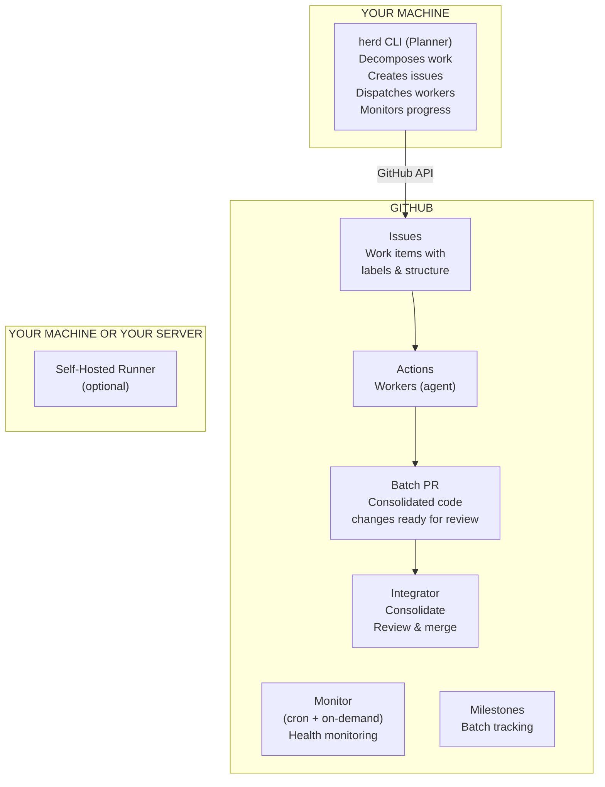
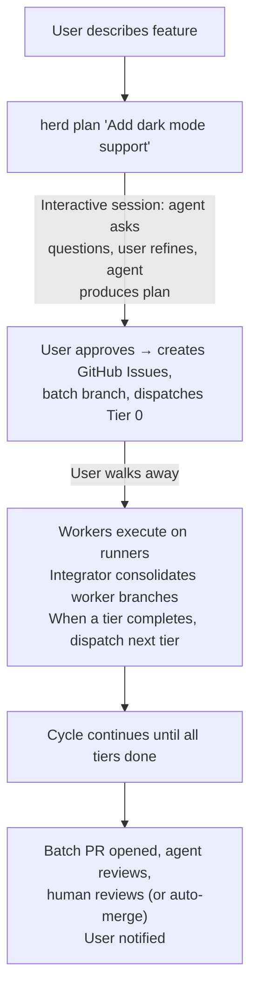
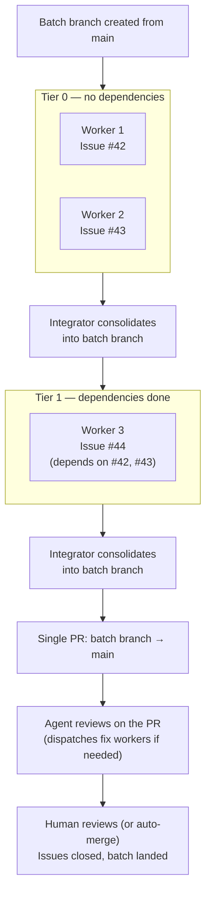
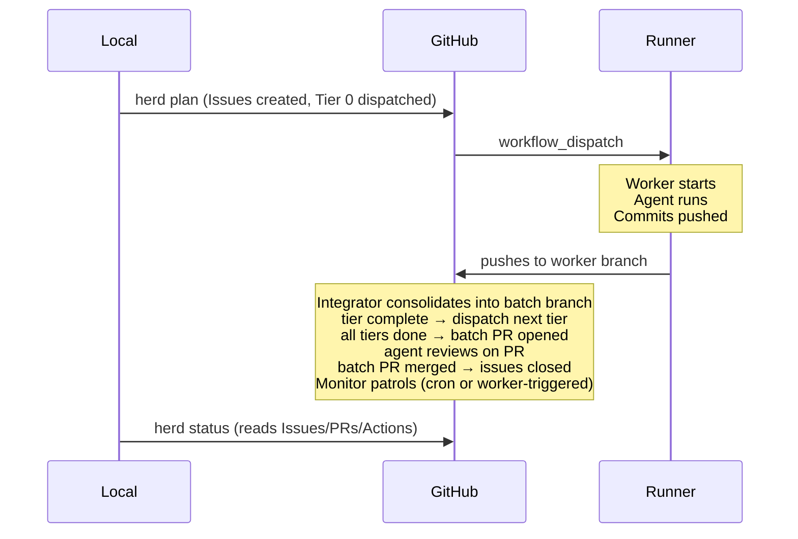
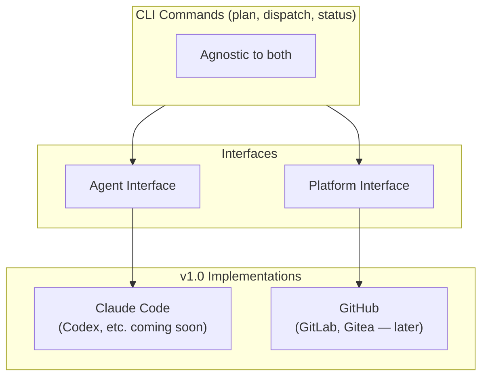

# Architecture

## System Overview

HerdOS has two halves: a local CLI (the Planner) and GitHub infrastructure (everything else). The CLI plans and dispatches. GitHub executes, tracks, and reports.

## Data Flow

### Default flow (plan, dispatch, land)

The entire flow after `herd plan` is self-driving. The Planner dispatches Tier 0 automatically, the Integrator advances tiers, and the user only intervenes if something fails or when the batch PR is ready for human review.

### Review and Fix Details

Agent review collects `/herd fix` comments from the batch PR before reviewing, so user-requested fixes are not flagged as violations. It then classifies findings by severity (HIGH, MEDIUM, LOW). HIGH and MEDIUM severity findings trigger fix workers. LOW findings are included in the PR comment for reference but do not block merge or create fix issues.

Each review cycle creates at most one batch fix issue containing all HIGH findings, rather than one issue per finding. The agent submits a Request Changes review to block merge while fix cycles are active. When the review passes, the agent approves and posts a batch summary with statistics (files reviewed, findings by severity, fix cycles used).

Workers run pre-push validation before pushing changes. For Go repositories, this includes `go build`, `go test`, `go vet`, and `golangci-lint` (if available). If validation fails, the agent is retried once with the error output. Workers post structured reports on their issues with files changed, a summary of work done, and validation results.

When the Integrator processes commands (Consolidate, Advance, AdvanceByBatch, CheckCI), it skips batches whose milestones are already closed, avoiding redundant work on completed batches.

Opening a batch PR is idempotent: if two concurrent integrator runs both attempt to create the PR, the second detects the existing one (via listing or by handling a 422 race) and returns the existing PR number.

### Worker, Consolidate, PR flow

## Component Boundaries

### Local (your machine)

| Component | Responsibility |
|-----------|---------------|
| `herd` CLI | User interface. Plans work, creates issues, dispatches workers, shows status. |
| Planner logic | Work decomposition. Uses the configured agent locally to break features into issues. |
| Config | `.herdos.yml` -- repo-level settings for workers, labels, runners. |

### GitHub (cloud)

| Component | Implemented As | Responsibility |
|-----------|---------------|---------------|
| Work items | Issues + Labels | Track what needs doing, who's doing it, what state it's in. |
| Workers | Actions (workflow_dispatch) | Execute tasks. Each worker reads an issue, runs the agent in headless mode, pushes to a worker branch. |
| Integrator | Action (workflow_run + pull_request_review + issues) | Consolidate worker branches into batch branch, agent-review the result, open single batch PR, handle conflicts, merge after approval. |
| Monitor | Action (schedule + workflow_dispatch) | Health patrol. Detect stale issues, failed runs, stuck PRs. Triggered by cron and on-demand by workers on failure. |
| Batches | Milestones | Group related issues. Track delivery progress. |

### Self-Hosted Runners

Workers need a runner with the agent CLI installed. Options:

1. **Self-hosted on your machine** -- free, uses your hardware
2. **Self-hosted on a cloud VM** -- scalable, costs money, good for teams
3. **GitHub-hosted runners** -- simplest setup, but need the agent CLI in the environment

The runner is where the agent actually executes. The Action workflow orchestrates the checkout, issue reading, and branch pushing around it.

## What Runs Where

## Key Design Decisions

1. **GitHub is the source of truth.** No local database. All state lives in Issues, PRs, and Action logs.
2. **Event-driven, not polling.** Workers trigger on `workflow_dispatch`. Integrator triggers on `workflow_run`. Monitor triggers on `schedule` and `workflow_dispatch`. No busy-waiting.
3. **Workers are stateless.** Each worker gets a fresh checkout of the batch branch, reads its issue, does work, and pushes to a worker branch. No persistent state between runs.
4. **The CLI is thin.** It's a GitHub API client that delegates to the configured agent for planning. All heavy lifting happens on GitHub.
5. **Fail-safe by default.** Workers can't push to main. All changes go through PRs. Branch protection enforced.

## Abstraction Layers

HerdOS has two abstraction boundaries: the **Platform** (where work is tracked and executed) and the **Agent** (what does the thinking). Both are interfaces with swappable implementations.

The CLI does not hardcode GitHub API calls or Claude Code invocations. All platform interactions go through a Platform interface. All agent interactions go through an Agent interface. v1.0 ships with GitHub and Claude Code implementations. Other implementations can be added later without touching core logic.
