# Execution Design

How work flows from plan to landed code. This document covers the end-to-end
execution pipeline: worker lifecycle, DAG-based tier execution, consolidation,
agent review, conflict resolution, monitoring, and batch management.

---

## 1. End-to-End Flow

The happy path from user request to merged code:

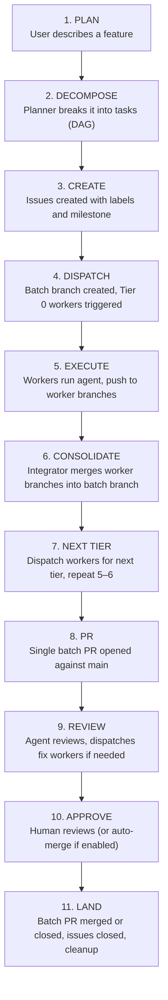

The user runs `herd plan` and the system handles everything from there. The
Planner decomposes work into a DAG, creates issues with a milestone, and
dispatches Tier 0. The Integrator advances tiers automatically. Come back when
the batch PR is ready for review (or already merged, if auto-merge is enabled).

---

## 2. Workers

A worker is a single GitHub Actions workflow run. It receives an issue number,
checks out the batch branch, reads the issue body, runs the agent headlessly,
commits the result to a worker branch, and exits. Workers are stateless and
ephemeral -- GitHub Actions handles scheduling, logging, and cleanup.

### Lifecycle

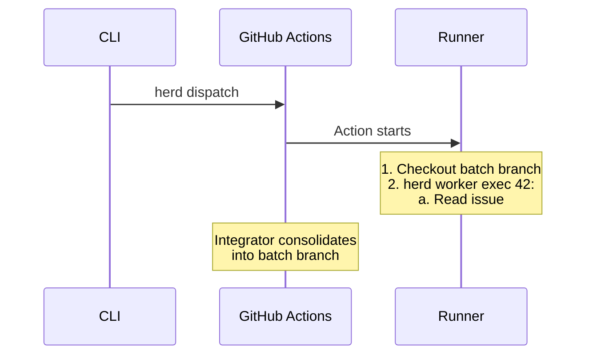

### Branch Discipline

Workers operate exclusively on their assigned worker branch
(`herd/worker/<N>-<slug>`). They do not create new branches, do not push to
any other branch, and do not open pull requests — only the Integrator opens
the single batch PR after all tiers complete. This rule is enforced via a
hard `## Branch & PR Discipline` section near the top of the worker prompt
template, which also instructs the agent to ignore any inline task body
content that says to create a new branch or open a separate PR. Consolidation
of the worker branch onto the batch branch is the Integrator's
responsibility (see [Section 4: Consolidation](#4-consolidation)).

### Headless Permissions

Workers run in fully automated CI with no human present. The agent must never
pause for permission prompts. This is safe because workers run on isolated
self-hosted runners (or ephemeral containers), operate on disposable worker
branches, and the Integrator reviews all changes before they reach main.

An optional `max_turns` setting limits agentic turns to prevent infinite loops
in headless mode. When set to zero (default), the agent uses its own limit.

### Commit Attribution

Worker commits attribute both the human and HerdOS:

- **Author**: the dispatching user (captured from `git config` at dispatch time)
- **Co-author**: HerdOS, via a `Co-authored-by` trailer

### Role Instructions

If `.herd/worker.md` exists in the repository, its contents are appended to the
worker's system prompt. Convention-based, no configuration needed.

### Pre-Push Validation

Before pushing changes, workers run validation commands:
1. `go build -buildvcs=false ./...`
2. `go test -buildvcs=false ./...`
3. `go vet ./...`
4. `golangci-lint run ./...` (if available)

If validation fails, the agent is re-invoked with the error output. If it fails again after retry, the worker is marked as failed.

#### Validation Marker

The worker code (not the agent) records the outcome of pre-push validation in two
files under `.herd/progress/`, both keyed by issue number and both committed so
they survive across worker invocations:

- `.herd/progress/<N>.validation` — an empty marker file written **only** after
  `runValidation` reports that every command passed. Its presence means
  "validation actually passed for this issue." The marker is removed at the start
  of every agent invocation and on any validation failure, so a stale marker from
  a previous pass can never be carried over.
- `.herd/progress/<N>.validation.errors` — the combined output of the failing
  validation commands, written whenever validation fails (and removed once
  validation passes). The output is truncated to ~16 KB, keeping the tail since
  the most relevant errors appear last. On the next attempt the worker reads this
  file and injects it into the agent prompt under a
  `## Previous attempt's validation failed with:` heading.

These files are written, removed, and committed by the worker framework. They are
distinct from the agent-written `.herd/progress/<N>.md` checklist described under
[Incremental Push and Progress Tracking](#incremental-push-and-progress-tracking):
the progress file reflects only what the *agent* claims it finished, while the
validation marker reflects whether validation *actually* passed.

Validation is Go-specific — it only runs when a `go.mod` file exists in the repository root.

### Worker Reports

After completing a task, workers post a structured report on the issue:
- Files changed (git diff stat)
- Summary of work done
- Validation results (build/test/vet/lint status)
- Full agent output in a collapsible details block

Workers also post a report on the no-op path (when no changes are needed). The
no-op report includes a "No changes were needed" message with the agent output
in a collapsible details block. Additionally, the worker posts a summary comment
on the batch PR so the reviewer can see why no changes were made. This prevents
the reviewer from creating fix issues for work that was already determined to be
unnecessary. Format: **Worker #N (no-op):** No changes needed. <explanation>

### Image Preprocessing

Before invoking the agent, the worker scans the issue body for GitHub-hosted
attachment images (URLs matching `github.com/user-attachments/assets/*`,
`github.com/<owner>/<repo>/assets/*`, and
`private-user-images.githubusercontent.com/*`). Matched images are downloaded to
`.herd/tmp/images/` and the markdown URLs are replaced with local file paths so
the agent can view them directly. External image URLs are left unchanged for the
agent to handle. Downloading is best-effort -- if the HTTP client is unavailable
or a download fails, the original URL is preserved.

### Incremental Push and Progress Tracking

Workers push incrementally during execution to preserve partial work. The
agent's system prompt instructs it to run `git push` after completing each
file or logical unit. This ensures that if the worker times out or crashes,
the retry starts from where it left off rather than from scratch.

The configured `workers.timeout_minutes` value remains the outer GitHub Actions
job timeout. Inside that job, HerdOS gives the agent a shorter execution
deadline so there is time left for cleanup before GitHub Actions cancels the
whole worker. When the inner deadline fires, HerdOS attempts to stop the agent
process. On Unix-like runners the shared process helper starts agent commands in
their own process group and terminates that group where possible; on Windows it
falls back to terminating the direct child process. The process-group behavior is
important for agents such as Codex, whose Node wrapper can spawn a native
`codex` child process.

To track progress, the agent creates a `.herd/progress/<issue-number>.md` file
before its first push. Each worker writes to a unique file (e.g., issue #17
writes to `.herd/progress/17.md`), preventing merge conflicts between parallel
workers. This file contains a checklist of completed and remaining items. On
retry, the agent reads the existing file to understand what was already done.

The `.herd/progress/<issue-number>.md` file is **agent-written** and means only
"the agent claims its checklist is done." It is not proof that the work is
correct — for that, the worker relies on the separate, worker-written
`.herd/progress/<issue-number>.validation` marker (see
[Validation Marker](#validation-marker)), which is present only when pre-push
validation actually passed. It also is not the only timeout recovery mechanism:
when the agent times out before it can commit and push its own progress, HerdOS
uses checkpoint commits as the orchestrator-level fallback.

Example `.herd/progress/17.md`:
```
- [x] Create auth model in internal/auth/model.go
- [x] Add validation helpers
- [ ] Write unit tests
- [ ] Update API handler
```

The Integrator removes the `.herd/progress/` directory during consolidation
(after merging the worker branch into the batch branch) so progress files
do not appear in the final batch PR. This removes everything under that
directory, including the worker-written `.herd/progress/<issue-number>.validation`
marker and `.herd/progress/<issue-number>.validation.errors` files, so none of
them leak into the final batch PR either. For backward compatibility, legacy
`WORKER_PROGRESS.md` files at the repo root are also removed.

#### Live Progress Updates

While the agent is working, the worker posts a progress comment on the issue and updates it periodically with the contents of the `.herd/progress/<issue-number>.md` file. This provides live visibility into what the agent has completed and what remains. The update interval is configurable via `workers.progress_interval_seconds` (default: 30 seconds, set to 0 to disable). When the worker finishes, the progress comment is updated one final time and kept on the issue for history.

#### Retry Resume

When a worker is re-dispatched for a previously timed-out task, it checks
whether the worker branch already exists on the remote. If it does, the
worker checks out the existing branch (which contains partial work from the
previous attempt) instead of creating a fresh branch from the batch branch.
The agent then reads `.herd/progress/<issue-number>.md` to continue where
the previous attempt stopped. If the previous attempt reached the inner timeout,
the branch may also contain a worker-created checkpoint commit that preserved
uncommitted repository changes before the outer GitHub Actions timeout.

If the merge of the batch branch into the resumed worker branch fails (e.g.,
because the batch branch has diverged with conflicting changes from other
workers' consolidation), the worker aborts the merge, deletes the stale worker
branch (both locally and on the remote), removes the
`.herd/progress/<issue-number>.md` file, and creates a fresh worker branch from
the current batch branch. A warning is logged:
"Merge conflict when updating resumed worker branch, starting fresh from batch
branch." The previous partial work is lost, but this is preferable to crashing
and leaving the issue stuck as failed.

The skip-agent fast path requires **both** signals: the progress file
(`.herd/progress/<issue-number>.md` or legacy `WORKER_PROGRESS.md`) must show all
items checked off — every checkbox is `- [x]` and none are `- [ ]` — **and** the
worker-written `.herd/progress/<issue-number>.validation` marker must be present.
When both hold, the worker skips agent invocation entirely. This handles the case
where a previous attempt completed all work, passed validation, and pushed it, but
timed out before posting the worker report. The worker still runs pre-push
validation (build, test, vet, lint), posts the worker report, pushes the branch,
and labels the issue as done.

When the progress file is complete but the validation marker is **absent** — the
previous attempt's validation failed, so the marker was removed and never
re-created — the worker does **not** take the fast path. Instead it re-invokes the
agent and injects the saved `.herd/progress/<issue-number>.validation.errors` into
the prompt under `## Previous attempt's validation failed with:`. In this case the
worker uses a retry prompt variant that explicitly tells the agent the progress
file is **stale** and must not be honored: the validation errors are the only task,
and the agent must not skip work just because the checklist looks complete.

If the progress file shows incomplete work, the normal retry flow continues (the
agent is launched with the progress file as context to continue where the previous
attempt stopped).

#### Timeout Checkpoints

On inner agent timeout, the worker inspects git state before returning failure:

- If batch-mode committed work already exists on the worker branch, HerdOS leaves
  it preserved there for retry and returns failure.
- If batch-mode uncommitted work exists, HerdOS creates a checkpoint commit on
  the worker branch and pushes it. A Monitor retry can then resume from the
  remote worker branch, but the timed-out attempt still fails.
- If standalone fix mode has uncommitted work, HerdOS creates a checkpoint commit
  on the PR head branch, pushes it to that branch for preservation, then comments
  timeout diagnostics on the tracking issue and PR without marking the task done.
- If no committed or uncommitted work exists, HerdOS posts a clear diagnostic
  failure comment and lets the Monitor retry the issue.

Checkpoint commits complement `.herd/progress/<issue-number>.md`: the progress
file is the agent's checklist, while a checkpoint commit is the worker's fallback
for preserving actual repository state when the agent timed out before it could
commit or push.

A timeout checkpoint preserves work; it is not a successful worker completion.
The timed-out attempt remains failed/retryable and does not create
`.herd/progress/<issue-number>.validation`, apply `herd/status:done`, or make the
worker branch eligible for completed-worker consolidation.

### Concurrency

Multiple workers run simultaneously on separate branches. Concurrency is bounded
by runner availability, the `max_concurrent` config setting (default 3), and
GitHub Actions limits.

### Failure Modes

| Failure | Response |
|---------|----------|
| Worker crashes mid-task | Partial work preserved via incremental pushes; Action fails; worker triggers Monitor for immediate response; Monitor re-dispatches; retried worker resumes from existing branch and `.herd/progress/<issue-number>.md`; if the batch branch has diverged and merge conflicts, the worker falls back to a fresh branch (partial work is lost); the retry skips agent invocation and proceeds directly to validation and reporting only when the progress file shows all work complete **and** the `.herd/progress/<issue-number>.validation` marker is present — otherwise the agent is re-invoked with the saved validation errors |
| Inner agent timeout | Worker attempts to stop the agent process; Unix-like runners use process-group termination where possible, while Windows falls back to direct child termination; committed work remains on the worker branch for retry; uncommitted batch work is checkpointed and pushed on the worker branch for retry; uncommitted standalone fix work is checkpointed and pushed to the PR head branch for preservation; the timed-out attempt remains failed/retryable with no validation success marker, no `herd/status:done`, and no completed-worker consolidation; no-work timeouts get a diagnostic failure comment and Monitor retry |
| Worker produces bad code | Integrator dispatches fix workers up to the CI fix cap; at cap, reverts consolidation and labels issue failed |
| Worker can't complete task | Labels issue failed, triggers Monitor; Monitor comments diagnostics and @mentions notify_users |
| Work already done (no-op) | Posts a Worker Report comment ("No changes were needed"), labels issue done without creating a branch; Integrator advances normally |
| Stale conflict resolution issue | Automatically closed after successful consolidation; worker closes no-op conflict issues directly; non-fast-forward errors on stale branches don't block advance/review |
| Runner offline | Action queues until a runner is available; no special handling |

---

## 3. DAG and Tiers

Tasks in a batch form a directed acyclic graph based on their `depends_on`
declarations. The DAG determines execution order:

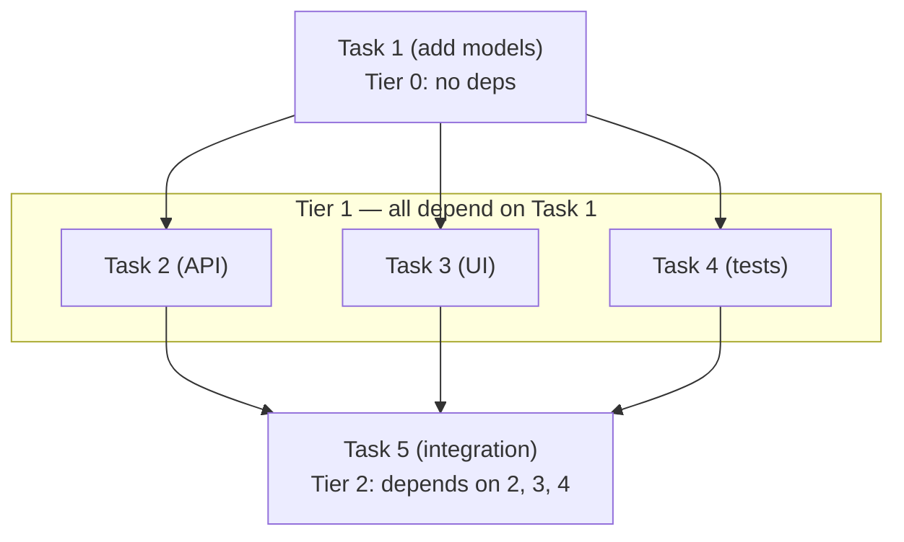

Tasks within a tier run in parallel. Tiers execute sequentially.

### Tier Assignment (Kahn's Algorithm)

1. Build a dependency graph from each issue's `depends_on` field
2. Issues with no dependencies are Tier 0
3. Issues whose dependencies are all in Tier N or earlier are Tier N+1
4. If a cycle is detected (no zero-in-degree issues remain but unassigned issues
   exist), the CLI reports the circular dependencies and refuses to dispatch

Cross-batch dependencies are not supported. All `depends_on` references must
point to issues within the same milestone; the CLI validates this during
planning and dispatch.

### Tier Completion

A tier is **complete** when all its issues are `herd/status:done`. If any issue
is `herd/status:failed`, the tier is **stuck** -- the Integrator does not
advance. The Monitor detects stuck tiers and can re-dispatch failed issues or
escalate.

### No Mid-Batch Rebase

The batch branch is not rebased onto main between tiers -- only when all tiers
are complete and the batch PR is about to open. Later-tier workers see prior
tiers' work but not changes that landed on main after the batch started. This
is intentional: mid-batch rebasing would invalidate prior tiers' work and
introduce unpredictable conflicts.

---

## 4. Consolidation

### Batch Branch Lifecycle

Every batch gets a long-lived branch: `herd/batch/<milestone-id>-<slug>`. It is
created from main when workers are first dispatched (by `herd plan` or
`herd dispatch`). Workers branch from it; the Integrator merges their work back
into it. When all tiers complete, this branch becomes the source of the single
batch PR against main.

### Consolidation Flow

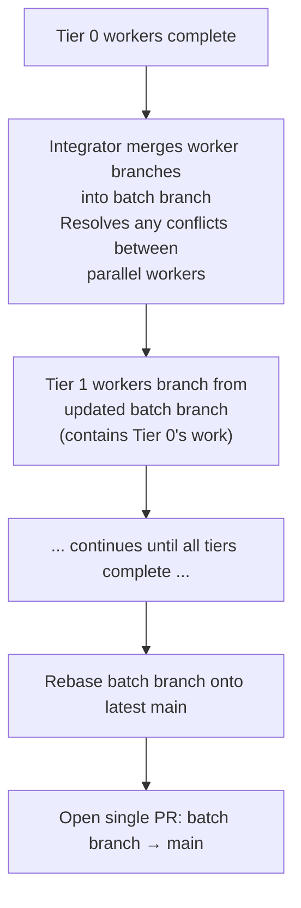

Opening the batch PR is idempotent: if concurrent advance-on-close triggers race, the second call detects the existing PR (via listing or by handling a 422 "already exists" error) and returns its number instead of failing.

Before opening the batch PR, the Integrator sanity-checks that the milestone's issue list returned by the GitHub API is complete (the count of fetched issues is at least `OpenIssues + ClosedIssues`). If the list is short — typically a transient partial API response — it logs `Warning: milestone #N has X expected issues (Y open + Z closed) but only K were returned by the API; skipping batch PR to avoid premature open` and skips PR creation; the PR opens on a subsequent advance once the API returns complete data. Likewise, if the issue triggering an advance is not found in any tier (another partial-response symptom), the Integrator logs `Warning: issue #N not found in any tier of milestone #M (possibly partial API response); skipping advance` and treats the trigger as a no-op rather than returning an error.

### Run-to-Milestone Resolution

`herd integrator consolidate --run-id <N>` is a **milestone-wide, batch-level**
operation, not a single-branch merge. The triggering run identifies which
milestone to operate on; the Integrator then processes every eligible worker
branch in that milestone in a single invocation.

1. Query the run's workflow_dispatch inputs to extract the issue number, and
   read that issue's milestone — this is the only role the run ID plays. The
   triggering issue's per-call result is what the command returns; per-issue
   outcomes for other workers in the milestone are logged but not returned.
2. If the run's conclusion is `failure` or `cancelled`, relabel the triggering
   issue as `herd/status:failed` and return. Skip the milestone-wide scan in
   this case to preserve the trigger-failure semantics.
3. Otherwise, list every issue in the milestone and build the candidate set:
   issues labeled `herd/status:done` whose worker branch
   (`herd/worker/<number>-<slug>`) still exists on the remote. Failed and
   in-progress issues are skipped — their workers either didn't finish or are
   not yet ready for consolidation.
4. Sort candidates by issue number for deterministic ordering, then merge each
   into the batch branch. Branches whose tip is already contained in the
   batch branch are detected via `git merge-base` and skipped (the worker
   branch is deleted as a no-op).
5. Conflicts and push failures on one candidate do not abort the loop. The
   per-branch handler (`handleConflictResolution` for `dispatch-resolver`, or
   the notify path) runs for that branch only and the loop continues with
   the next candidate.

### Self-Healing Consolidation

Because every successful consolidation invocation re-scans the whole
milestone, stranded worker branches recover automatically on the next run.
This matters whenever an integrator run is interrupted mid-loop —
`cancel-in-progress` on the integrator workflow, runner timeouts, or transient
GitHub Actions failures can all leave one or more `herd/status:done` issues
whose worker branches were never merged. No manual cleanup is needed: the
next workflow run that triggers consolidate (the next worker completion,
manual `/herd integrate`, or any other event that fires the integrator)
re-scans the milestone, finds the stranded branches still on the remote, and
merges them in.

Failed issues are explicitly excluded from the candidate set, so this
self-healing property never resurrects work that was already abandoned. Only
issues that reached `herd/status:done` and still have a remote worker branch
are picked up.

### Post-Merge Failure Handling

If the merge succeeds but the push is rejected (e.g., non-fast-forward), the
Integrator relabels the issue from `herd/status:done` to `herd/status:failed`
and posts a diagnostic comment. This ensures the issue is retried automatically.
The Integrator resets the local batch branch to match the remote before each
checkout, preventing stale-branch issues.

**Non-fatal consolidation failures do not block advance and review, and do not
abort the milestone-wide loop.** Push failures on stale branches and merge
conflicts in notify mode are treated as warnings — the issue is relabeled as
failed (for the Monitor to handle) and the loop continues with the next
candidate worker branch. Only the triggering issue's failure surfaces as the
command's return value; failures on other in-milestone candidates are logged.
The consolidate command returns success on the trigger so the workflow
continues to run advance and review. Only truly fatal failures (git
unavailable, authentication errors, corrupted state) cause the pipeline to
stop.

### Stale Conflict Issue Cleanup

After a successful consolidation push, the Integrator scans for open conflict
resolution issues in the same milestone whose worker branches no longer exist
(already consolidated or deleted). These stale issues are automatically closed
with the comment: "Automatically closed — batch branch is already up to date."

This prevents the Monitor from retrying stale conflict resolution issues that
would fail with non-fast-forward errors and block the integrator pipeline.

Additionally, if a conflict resolution worker completes with no changes (the
batch branch is already up to date), the worker closes the issue directly
instead of marking it as done.

### Already-Merged Branch Detection

Before attempting a merge, the Integrator checks if the worker branch's changes
are already in the batch branch (the merge base equals the worker branch tip).
If so, the merge is skipped, the worker branch is deleted, and the result is
treated as a no-op. This handles cases where a previous integrator run already
merged the branch but the issue was re-triggered.

### Branch Cleanup

**Worker branches** are deleted after successful consolidation. Failed worker
branches are kept for debugging until re-dispatch or batch cancellation.

**Batch branches** are deleted on cancel (`herd batch cancel`), on merge
(GitHub auto-delete or Integrator cleanup), or when the batch PR is closed
without merging (Integrator cleanup).

---

## 5. Agent Review and Fix Cycles

When all tiers complete and the batch PR opens, the Integrator prepares a
complete `DiffSet`, plans bounded review chunks, and dispatches the reviewer
once per chunk. The agent checks acceptance criteria, looks for bugs, security
issues, and style violations. When an acceptance
criterion restricts which files may be modified, the reviewer allows supporting
changes to configuration files, test helpers, test fixtures, and infrastructure
files if they are clearly required for the primary task to work. Before reviewing, the
reviewer collects any `/herd fix` comments from the batch PR and appends them
to the acceptance criteria list as `"User requested: <description>"`. This
ensures the reviewer checks user-requested changes equally alongside original
acceptance criteria, rather than treating them as a separate prompt section.

The review agent runs under a strict output contract: it must not call tools,
shell out to `gh`/`git`/`bash`, create issues or comments, or modify files. Its
only output is a single JSON object describing findings. The user prompt
includes a self-check section that asks the agent to confirm it produced JSON
only and took no action. In chunked mode, each prompt identifies the chunk
number and included path range, and instructs the agent to review only that
chunk; other chunks are reviewed in separate strict-output runs. If unparseable
output is returned, the integrator retries once in-call (see
[Agent Error Resilience](#10-agent-error-resilience)) before posting a
manual-intervention comment.

After all planned chunks finish, HerdOS aggregates findings, deduplicates
duplicate reports across chunks, and posts one coherent review result marker for
the PR head SHA. Batch PR review creates one batched fix issue for actionable
findings instead of one issue per chunk. Standalone `/herd review` uses the same
chunk aggregation for its findings comment, but it does not create fix issues or
dispatch workers.

### User Feedback

The reviewer also collects non-HerdOS user comments from the PR and passes them
to the agent as a `## User Feedback` section. Users can comment on a PR to push
back on findings (e.g., "The nil check finding is a false positive — the caller
guarantees non-nil") and the next review cycle will see that comment and skip
re-flagging the issue. The agent is instructed to treat user feedback as
authoritative:

- If a user says a finding is a false positive, the agent will not re-flag it.
- If a user provides context explaining why code is correct, the agent accepts their explanation.
- If a user requests a specific change, the agent treats it as a requirement.

HerdOS bot comments (review findings, integrator messages, worker progress) are
filtered out of user feedback collection so they don't feed back into the
reviewer's prompt. This applies to both batch PR reviews and standalone
`/herd review` runs on non-batch PRs.

### Severity-Based Filtering

Review findings are classified by severity:

| Severity | Examples | Action |
|----------|----------|--------|
| HIGH | Bugs, security vulnerabilities, race conditions, missing critical error handling | Actionable at any `review_fix_severity` |
| MEDIUM | Missing edge cases, suboptimal error handling | Actionable when `review_fix_severity` is `medium` or `low` |
| LOW | Style preferences, naming suggestions | Actionable when `review_fix_severity` is `low`; otherwise informational |
| CRITERIA | Acceptance criterion is wrong, incomplete, or contradictory | Listed in PR comment as requiring human review, no fix workers |

The CRITERIA severity is distinct from code issues. When the reviewer identifies
that an acceptance criterion itself is flawed (not the code), it flags it as
CRITERIA. These findings appear in the PR comment under a separate
"**CRITERIA** (requires human review)" section but never generate fix issues,
because changing acceptance criteria requires human judgment.

The `review_strictness` setting (standard/strict/lenient) controls which issues the agent flags. See [Configuration](../configuration.md#review-strictness) for details.

### Review Outcomes

| Result | Action |
|--------|--------|
| Approved | Agent posts a batch summary with statistics (files reviewed, findings by severity, fix cycles used). PR is ready for human review (or auto-merge). |
| Changes requested | Agent submits a Request Changes review to block merge. Integrator creates a single batch fix issue for all actionable findings. |

### Fix Cycle Flow

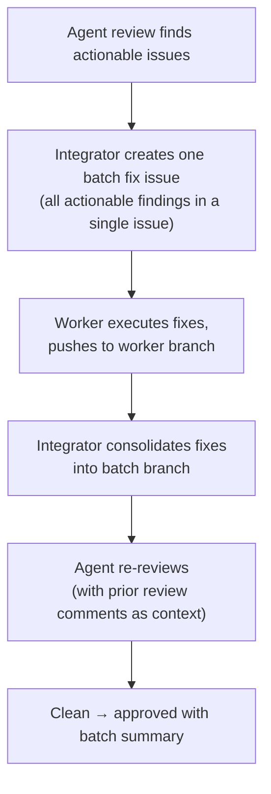

Fix issues are labeled `herd/type:fix`, have no dependencies (run in parallel),
and track which review cycle spawned them via a `fix_cycle` field and a
`batch_pr` reference back to the PR.

#### Review fix-issue dedup

New review findings are deduplicated only against fix issues whose herd status
is `herd/status:in-progress` or `herd/status:ready` — the active set, where a
worker is either running or queued to address the finding. Fix issues with
status `herd/status:done` (worker completed but the batch has not yet merged)
or `herd/status:failed` are past attempts and do **not** suppress new findings.
If the reviewer flags the same finding in a later cycle, that is evidence the
previous attempt did not resolve it, so the Integrator dispatches a fresh fix
worker rather than treating the recurring finding as already covered.

When a worker is dispatched for a fix issue, its system prompt includes an
additional instruction prioritizing the reviewer's findings over original
acceptance criteria. This prevents fix workers from checking the original
criteria, finding them satisfied, and no-oping — ignoring the reviewer's
concern entirely. If the fix worker genuinely believes the reviewer is wrong
after careful analysis, it explains its reasoning in detail rather than
silently doing nothing.

When `/herd fix` creates a fix issue, all comments from the batch PR are
included as a `## Conversation History` section in the issue body. Each comment
is formatted as `**@author:**` followed by the comment body, separated by `---`.
This gives the fix worker full context of prior fix requests and review feedback.

If the assembled body would exceed GitHub's 65,536-char limit, herd truncates
it at the last clean boundary, appends a visible marker pointing at follow-up
comments, and posts the remainder as one or more "Part N of M" comments on the
same issue. The same handling applies to Review fix-issues, CI fix-issues, and
conflict-resolution issues — see [github-integration.md → Body Size Limit](github-integration.md#body-size-limit).

`/herd fix` also detects conflict-related keywords in the description (e.g.,
"merge conflict", "rebase conflict", "conflict with main"). When detected, the
handler automatically appends explicit git merge/rebase instructions to the fix
issue body so the dispatched worker knows to follow the step-by-step conflict
resolution procedure rather than attempting ad-hoc fixes.

On each re-review, the reviewer receives its prior review comments as context to
maintain consistency and avoid contradicting previous decisions. This cycle
repeats until the agent approves or `review_max_fix_cycles` is
reached (default 0 = unlimited), at which point the Integrator comments on the PR with the remaining
issues and waits for human intervention.

### Safety Valve

If a single review cycle finds more than **10 issues**, the Integrator does not
create fix workers. Instead, it comments on the PR with all issues found and
escalates to the user. This prevents a confused or overzealous agent from
generating dozens of fix workers in one pass.

### Interaction with Auto-Merge

| review | auto_merge | Behavior |
|--------|------------|----------|
| true | false | Agent reviews first, then human. Human gets a pre-screened PR. (Default) |
| true | true | Agent is gatekeeper. Approves + CI pass = auto-merge. Issues block merge and trigger fix workers. |
| false | true | No agent review. PR auto-merges as soon as CI passes. |
| false | false | No agent review. Human reviews the batch PR directly. |

### Stable disagreement

When the reviewer keeps flagging the same findings cycle after cycle and a fix
worker keeps responding with "no change needed" (after reading the issue and
verifying the code), HerdOS detects the loop and pauses automatic review.

**Detection.** Each fix worker that exits in the no-op path posts a structured
`**Worker #N — no-op verdict**` comment on the batch PR with finding-by-finding
reasoning. On the next review cycle, the Integrator passes those verdicts to
the reviewer as authoritative context **and** compares the new findings against
them. If the reviewer flags a finding that substantially matches a verdict
(same first-100-character substring heuristic used for [fix-issue dedup](#review-fix-issue-dedup)),
the Integrator halts the cycle.

**Halt behavior.** When stable disagreement is detected, the Integrator:

- Does **not** create a new fix issue.
- Does **not** dispatch a fix worker.
- Adds the `herd/stable-disagreement` label to the batch PR.
- Posts a comment on the PR listing the re-flagged findings, the worker
  verdicts, and the resolution options.

While the `herd/stable-disagreement` label is present, automatic review is
suspended. Manual `/herd review` and `/herd integrate` slash commands still
execute — they bypass the label.

**Recovery.** The user has three options:

1. **The workers were right** — post `/herd fix` with explicit acceptance
   criteria that close out the findings, or `/herd integrate` to merge as-is.
2. **The reviewer was right** — post `/herd fix` with concrete `file:line`
   evidence that contradicts the worker verdicts.
3. **Resume automatic review** — remove the `herd/stable-disagreement` label
   and post `/herd integrate`.

---

## 6. Conflict Resolution

Conflicts can occur in two places.

### Between Parallel Workers (Same Tier)

When workers in the same tier modify overlapping files, the Integrator
reconciles during consolidation:

1. **Auto-rebase.** If changes don't textually conflict, rebase succeeds.
2. **Dispatch a conflict-resolution worker.** The Integrator creates a fix issue
   describing the conflict, the conflicting files, and the intent of each
   worker. The resolver runs as a normal worker on its own assigned worker
   branch (`herd/worker/<fix-issue>-<slug>`). It runs `git fetch origin`,
   `git merge origin/<conflicting-branch>`, resolves the conflict markers,
   `git add`, and `git commit`. It does **not** `git push` and does **not**
   `git checkout` the batch branch. The worker framework's normal
   force-push of the worker branch carries the resolution commit, and the
   Integrator's standard consolidate flow then merges the resolved worker
   branch into the batch branch.
3. **Notify the user.** Comment on the relevant issues with conflict details.
   The user resolves manually.

### Between Batch Branch and Main

Main may advance while the batch executes. Before opening the PR, the Integrator
rebases the batch branch onto latest main. If this conflicts, the same
resolution strategies apply: a resolver worker is dispatched and follows the
same flow described above (stay on its own worker branch, `git merge` the
default branch, commit, do not push). The worker framework pushes the worker
branch, and the Integrator's consolidate flow merges it into the batch branch.
No agent force-pushes the batch branch.

The configured strategy (`on_conflict: notify | dispatch-resolver`) controls
which path is taken. The resolver is capped at `max_conflict_resolution_attempts`
(default 2); when that budget is exhausted, the batch enters cascade-failed
state — see [When cascades fail](#when-cascades-fail).

### Monitor-Detected Batch-vs-Main Conflicts

Previously, batch branch conflicts with main were only detected at PR creation
time (during the final rebase). The Monitor now detects these proactively during
patrol:

1. For each open batch PR with a `herd/batch/` head branch, the Monitor calls
   the single-PR `PullRequests().Get()` endpoint (the List endpoint does not
   populate the `Mergeable` field)
2. If `Mergeable == false`, the batch PR has conflicts with its base branch
3. The Monitor checks for the `herd/rebase-pending` label to prevent duplicate
   dispatches (same dedup pattern as `herd/ci-fix-pending` for CI fixes)
4. If no `herd/rebase-pending` label is present, the Monitor dispatches a rebase
   conflict resolution worker via `DispatchRebaseConflictWorker` and applies the
   label
5. When the PR becomes mergeable again, the `herd/rebase-pending` label is
   removed automatically
6. Dispatch respects the `max_conflict_resolution_attempts` cap

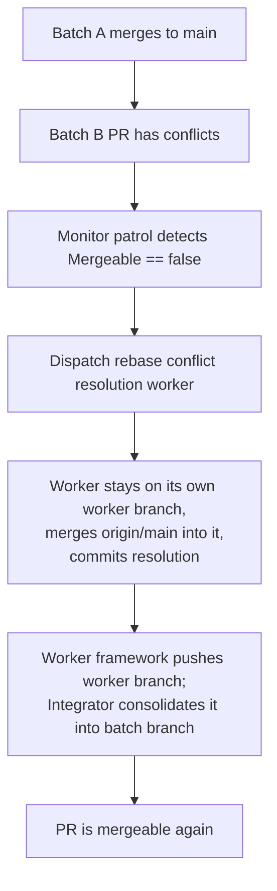

### Conflict Resolution Instructions

Conflict resolution issues (both worker-vs-worker and batch-vs-main) include
explicit step-by-step git instructions to guide the resolver worker. Both
flows use `git merge` against the resolver's own worker branch — the resolver
never checks out the batch branch and never pushes:

1. `git fetch origin`
2. Stay on the assigned worker branch (`herd/worker/<fix-issue>-<slug>`); do
   **not** run `git checkout` for the batch branch or default branch.
3. `git merge origin/<conflicting-branch>` (the worker branch of the other
   task for worker-vs-worker conflicts, or the default branch for
   batch-vs-main conflicts).
4. Resolve the conflict markers (`<<<<<<<`, `=======`, `>>>>>>>`) in place —
   do not rewrite files from scratch — to preserve intentional changes from
   both sides.
5. `git add <resolved files>` and `git commit` (accept the default merge
   commit message).
6. Do **not** `git push`. The worker framework pushes the worker branch
   automatically; the Integrator's normal consolidate flow then merges the
   resolved worker branch into the batch branch.

### When cascades fail

When a conflict-resolution worker itself produces a merge conflict, the
integrator creates a follow-up conflict-resolution issue to resolve it.
This can chain: an original failing worker → a first resolver → a second
resolver, and so on. The chain is bounded by `integrator.max_conflict_resolution_attempts`
(default: 2). When this budget is exhausted, the batch enters **cascade-failed**
state.

#### What triggers cascade-failed state

The integrator reaches the cap when counting `conflict_resolution: true`
issues in the milestone. On the next exhaustion event it:

1. Relabels the current failing issue `herd/status:failed`.
2. Adds the `herd/cascade-failed` label to the batch PR.
3. Posts a detailed comment on the batch PR listing the full cascade
   chain (e.g., `#641 → #643 → #644 (failed)`) and recovery steps.
4. CC's everyone in `monitor.notify_users`.

#### Label semantics

The `herd/cascade-failed` label is **set automatically** by the
integrator and **removed manually** by a human. While the label is
present on a batch PR, Herd refuses to create any new
conflict-resolution issues for that batch — every code path that would
otherwise dispatch a conflict resolver (`handleConflictResolution`,
`handleRebaseConflictResolution`, `DispatchRebaseConflictWorker`)
short-circuits with a 'paused' comment.

#### How to recover manually

The batch PR comment lists three options in priority order:

1. **Inspect** the failing worker branch:
   ```
   git fetch origin && git checkout <worker-branch>
   ```
2. **Rebase and resolve** locally, force-push the worker branch, then
   post `/herd integrate` on the batch PR to resume consolidation.
3. **Or close** the original failing issue if the work is no longer
   needed, then post `/herd integrate` to advance past it.

Once the underlying problem is handled, remove the `herd/cascade-failed`
label from the batch PR. The next `/herd integrate` (or workflow_run
trigger) will resume conflict resolution normally.

#### Why we intentionally stop retrying

Left unbounded, a single deep merge conflict can spawn an unbounded
chain of conflict-resolution issues, each producing an orphan worker
branch (e.g., `#641 → #643 → #644 → #645 → ...`). Each retry costs
tokens and produces noise; once two automated attempts have failed, the
remaining options require human judgment. The circuit breaker preserves
the batch's invariants while making the failure loud and the recovery
path explicit.

---

## 7. Monitor

The Monitor is a scheduled GitHub Action that audits system state and takes
corrective action. It is completely stateless -- each patrol cycle recomputes
everything from the GitHub API.

### Patrol Responsibilities

Each cycle:

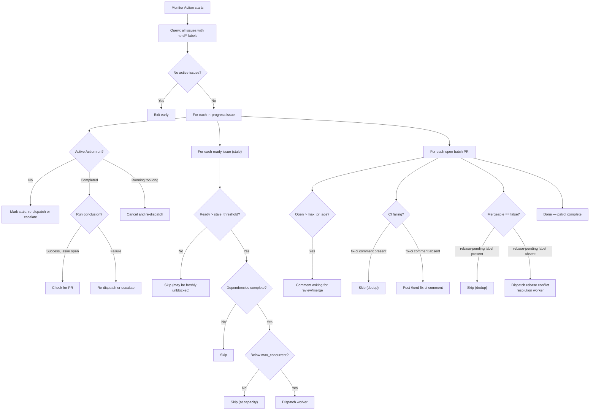

### Exponential Backoff

For repeatedly failing issues, the Monitor spaces out re-dispatch attempts:

- 1st failure: re-dispatch immediately
- 2nd failure: wait 15 minutes
- 3rd failure: wait 1 hour
- After `max_redispatch_attempts` (default 3): label `herd/status:failed`, stop

Backoff is enforced statelessly by comparing the most recent failed run's
timestamp against the required delay. The natural patrol interval (default
15 minutes) handles spacing; for the 1-hour wait, the Monitor skips ~3 cycles.

### Stateless Enforcement

The Monitor stores no state. Failure counts come from querying all completed
worker workflow runs filtered by issue number and counting those with
`conclusion: "failure"`. Backoff delays are enforced by timestamp comparison.
This means the Monitor can be restarted, re-deployed, or run on different
runners without losing track of anything.

### Stale Ready Issue Dispatch

When `max_concurrent` prevents the Integrator from dispatching all issues during
tier advancement, some issues are marked `herd/status:ready` but never dispatched.
On subsequent Integrator runs, the advance logic may skip these because the tier
is already considered complete.

The Monitor catches this: each patrol cycle lists all open `herd/status:ready`
issues. For each one that has been ready longer than `stale_threshold_minutes`,
the Monitor verifies that all `depends_on` dependencies are done or closed. If
so, it dispatches the issue (same as the Integrator would: label `in-progress`,
trigger `herd-worker.yml`). The `stale_threshold_minutes` delay prevents the
Monitor from racing with the Integrator's normal advance logic.

This dispatch respects `max_concurrent` globally — the Monitor only dispatches
up to the remaining capacity.

### Escalation

When auto-resolution fails, the Monitor comments on the issue with diagnostics
(Action run URL, error logs, time elapsed), @mentions the configured
`notify_users`, and labels the issue `herd/status:failed`. It uses GitHub's
native notification system exclusively -- no Slack, email, or external
integrations.

---

## 8. Batches

A batch is a group of related issues forming a delivery unit, mapped to a GitHub
Milestone.

### Why Milestones Over Projects

| Feature | Milestones | Projects |
|---------|-----------|----------|
| Setup complexity | Zero (built-in) | Requires project board creation |
| API simplicity | Simple REST endpoints | GraphQL-heavy |
| Progress tracking | Built-in percentage | Requires custom views |
| Issue association | Direct field on issue | Requires adding to project |
| Suitable for | Task batches with clear completion | Ongoing work streams |

Milestones fit because batches have a clear end state: all issues closed.

### Milestone Creation

Each batch is created by `herd plan` as a single GitHub Milestone titled with
the batch name chosen during planning. If a milestone with that exact title
already exists, the Planner retries with `<name> (2)`, `<name> (3)`, ..., up to
`<name> (10)`, using the first variant that does not exist. Existing milestones
are never adopted: a name collision usually indicates a prior `herd plan` run
that failed partway through issue creation, so the existing milestone may
contain stale issues that must not be mixed with the new plan. When a suffix is
applied, `herd plan` prints `Note: batch name conflicted with existing
milestone — using "<new-name>" instead.` and uses the resolved name for both
the milestone title and the batch branch slug. Non-conflict errors (e.g., 5xx)
are not retried — they surface immediately as `creating milestone: ...`. See
[Planner → Milestone Name Conflicts](planner.md#milestone-name-conflicts) for
the full rationale.

### Lifecycle

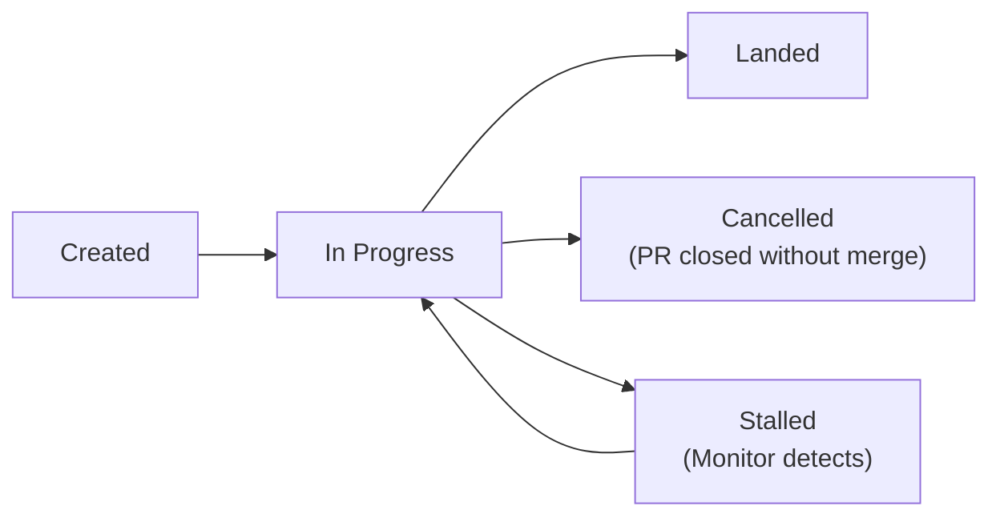

- **Created**: Milestone exists, issues created, nothing dispatched
- **In Progress**: At least one worker active or one issue done
- **Stalled**: Issues stuck (failed workers, unresolved conflicts); Monitor
  escalates
- **Landed**: All issues done, batch PR merged, milestone closed
- **Cancelled**: Batch PR closed without merging. Non-done issues are labelled
  `herd/status:cancelled` and closed. Done issues are closed without relabelling.
  Milestone is closed, branch is deleted.

### Cancellation

There are two ways a batch can be cancelled:

**CLI cancellation** (`herd batch cancel <number>`):

1. Cancels any active workflow runs for the batch's issues
2. Labels non-done open issues as `herd/status:cancelled` and closes all
   milestone issues. Issues already `herd/status:done` are closed without
   relabelling.
3. Closes the batch PR if one exists
4. Closes the milestone
5. Deletes the batch branch

Active workers may take a moment to stop -- Actions cancellation is asynchronous.

**Closing the batch PR without merging:**

1. Non-done issues are labelled `herd/status:cancelled` and closed. Issues
   already `herd/status:done` are closed without relabelling.
2. Milestone is closed
3. Branch is deleted

Both paths now use `herd/status:cancelled` for non-done issues, ensuring the
monitor does not redispatch them. The cancelled status is terminal.

---

## 9. Manual Tasks

Some tasks require human action (infrastructure setup, external service config,
approval gates). These are labeled `herd/type:manual` by the Planner and marked
with 👤 in status output.

Manual tasks participate fully in the DAG:

- **Not dispatched** -- `herd dispatch` skips them, and the internal `dispatchIssue` helper (used by `herd plan` and the Integrator) also skips them
- **Unblocked on tier advancement** -- when the previous tier completes, manual tasks transition from `blocked` to `ready` like any other task, but are not dispatched to workers
- **Completed by closing** -- a human closes the issue (or labels it
  `herd/status:done`); the Integrator's `advance-on-close` job detects the
  close event, advances the tier, and runs agent review if all tiers are done
- **Tier-aware** -- if a manual task is in Tier 0, Tier 1 won't dispatch until
  it's closed. Manual tasks that grant permissions or set up external services should always be in Tier 0 so they unblock automated tasks that depend on them
- **Notifications** -- when `notify_users` is configured, the Planner @mentions
  those users on manual task issues for visibility

### Manual-task findings forwarding

Manual tasks often produce information that downstream automated tasks need —
a chosen library version, an API key location, a configuration decision, the
shape of a value the human pasted into a secret. Workers, however, read only
their **own** issue body at execution time (`worker.Exec` calls `Issues().Get`
on its assigned issue; it never fetches dependency issues or their comments).
Planner-inlined dependency context is frozen at plan time, so findings that a
human records *after* planning would otherwise never reach the worker. The
Integrator closes this gap by forwarding those findings into the dependent
issue's body at dispatch time.

**When and what.** Just before `dispatchReadyIssues` dispatches an automated
issue, for each of that issue's `depends_on` entries that is a manual task
(label `herd/type:manual`) **and** complete (state `closed` or label
`herd/status:done`), the Integrator extracts the manual task's findings and
injects them into the dependent issue's body. Findings are simply:

- The manual task's issue body (with YAML front matter stripped via
  `issues.StripFrontMatter`), kept verbatim.
- Every human-authored comment on the manual issue, in chronological order.
  Comments whose author login ends in `[bot]` and comments whose trimmed
  body matches a known herd automated-comment prefix (e.g. `👋 **Manual
  task**`, `🔍 **HerdOS Agent Review**`, `📋 **Worker Progress**`) are
  excluded — those are not human findings.

There is no special syntax the human must use. Anything they write in the
issue body or as a non-bot comment is treated as findings.

**Injected block format.** The forwarded text is wrapped in herd-internal
HTML-comment markers keyed to the source manual issue:

```
<!-- herd:injected-findings:<N> -->
## Context from #<N> (manual task)

<extracted body + comments>

<!-- /herd:injected-findings:<N> -->
```

Humans never author these markers — they exist solely so the Integrator can
recognise an already-injected block.

**Idempotency.** Because injection is keyed by the source issue number, a
re-dispatch (or a second pass over the same dependent issue) detects the
existing `<!-- herd:injected-findings:<N> -->` marker and skips re-injecting.
The dependent issue's body therefore contains each manual dep's findings at
most once, regardless of retry count.

**Scope: manual deps only.** Only `herd/type:manual` dependencies forward
findings. An automated dependency's "output" is the code it commits to the
batch branch, which the worker already gets by checking out that branch —
there is nothing to forward. Scanning the dependency list for manual deps is
therefore the only extra work the Integrator does at dispatch time.

**Size caps.** Two limits apply:

- **Per dependency:** extracted findings are capped at 8 KB
  (`perDepFindingsCap` = 8192 bytes). Content beyond the cap is truncated at
  a UTF-8 rune boundary and replaced with a notice pointing at the source
  issue: `_...truncated; see #<N> for full findings._`.
- **Per dependent body:** if injecting a block would push the dependent
  issue's body over `issues.MaxIssueBodyChars` (65000, GitHub's
  safety-margin limit — see
  [github-integration.md → Body Size Limit](github-integration.md#body-size-limit)),
  that single injection is skipped with a warning. Dispatch still proceeds
  with whatever findings did fit, so an oversize manual dep never blocks the
  worker.

**Out of scope.** Findings are read at dispatch time only — edits a human
makes to the manual issue *after* its findings have been injected into a
dependent are not re-forwarded automatically (the keyed marker means a
subsequent injection pass treats that source as already done). Findings are
also unstructured: there is no schema, no typed fields, no machine-readable
contract — only freeform markdown that the downstream worker reads as part
of its prompt.

---

## 10. Agent Error Resilience

The claude agent package validates output from every agent invocation. When Claude Code exits with code 0 but returns suspicious output (empty, "Execution error", or very short single-line output under 20 characters), the system:

1. **Retries once** after a 5-second delay
2. If the retry also returns suspicious output, **returns an error** instead of treating it as a successful result
3. The worker posts a **"Worker failed"** comment on the issue explaining what happened
4. The deferred error handler labels the issue as `failed` and triggers the Monitor

This prevents the system from marking issues as done when the agent didn't actually do any work (e.g., during API instability).

The integrator also guards the review path. The review agent runs under a strict output contract: no tool calls, no `gh`/`git`/`bash` invocations, no issue or file mutations — its only output is a JSON object. If the agent returns unparseable output, the integrator retries once after a 5-second delay within the same invocation. If both attempts still fail, it posts the comment

```
⚠️ **HerdOS Integrator** — Agent review failed to produce valid output after 2 attempts. Run `/herd review` manually to retry.
```

on the batch PR and returns `ManualInterventionNeeded=true`, leaving the review surfaced for the operator rather than silently dropped.

Review diff preparation is large-PR-safe. In runner and CLI contexts HerdOS first uses local git diff collection from the checkout. If that cannot run, it tries GitHub's raw PR diff; if the raw diff is unavailable or rejected by GitHub's large-diff limit, it falls back to GitHub files API metadata and any bounded per-file patches GitHub provides. Review continues when one of those sources succeeds.

The rendered review input is bounded. Generated files, binary files, large lockfile diffs, mode-only changes, source-unavailable patches, and files that exceed internal byte or file-count limits can be summarized, omitted, or truncated. HerdOS then plans review chunks from the complete `DiffSet` and invokes the reviewer once per chunk in strict no-tools mode. Whenever the input is limited, the review output includes or logs a **Diff Coverage** summary with the source, included files, omitted files, truncated files, warnings, and omitted paths with reasons so users can see what the agent did not inspect in full.

Coverage affects approval. HerdOS blocks normal approval when material source files were not reviewed, or when the diff needed more chunks than the configured maximum. The PR receives a coverage warning and request-changes review instead of being approved from incomplete source coverage.

---

## 11. Failure Modes

### Worker Fails to Complete

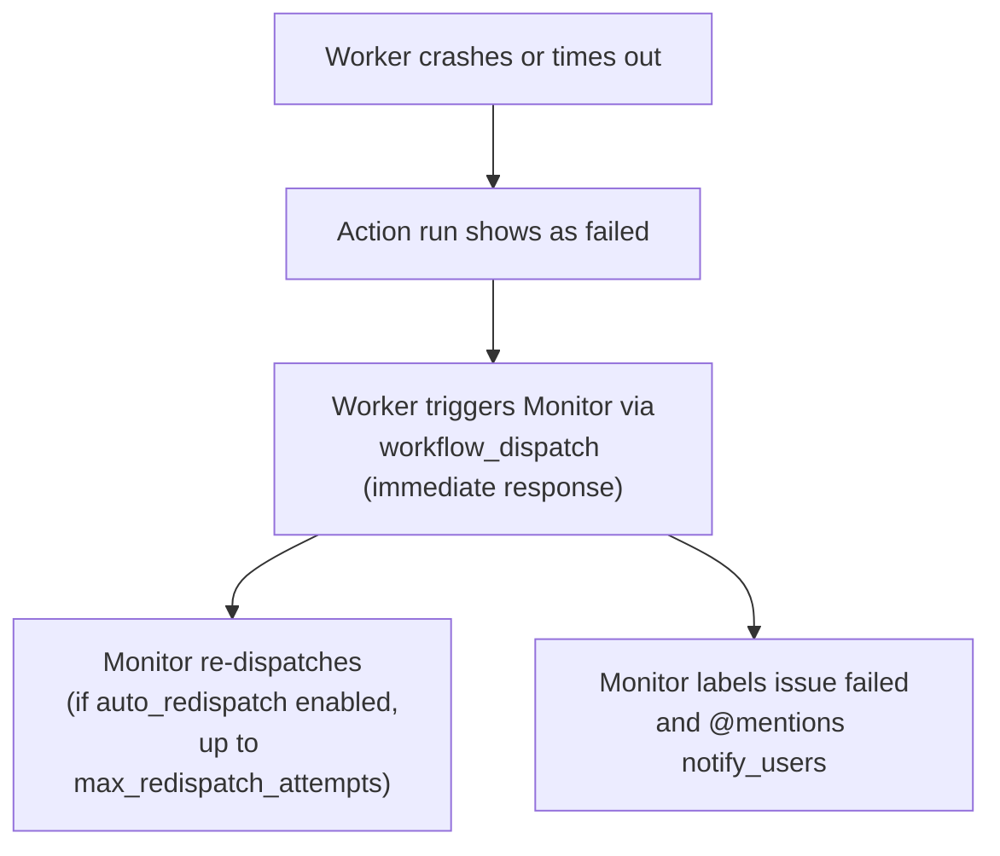

The batch branch is unaffected -- the failed worker's branch is never merged.

### Worker Produces Code That Doesn't Build

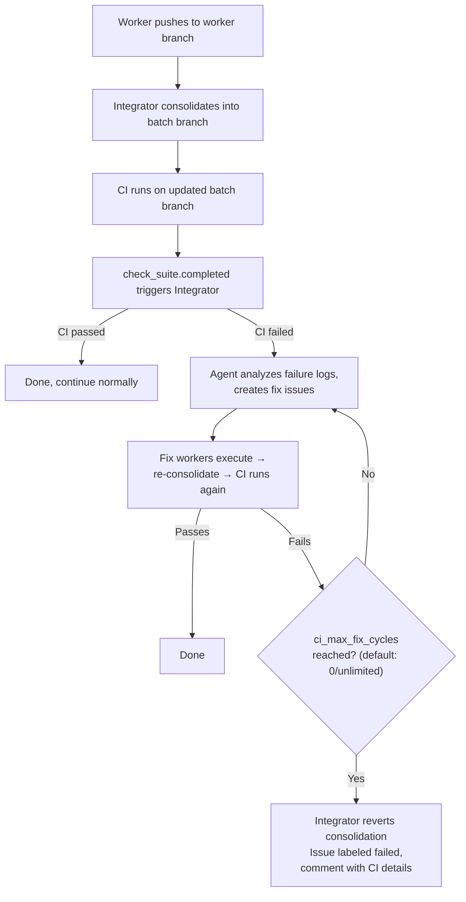

CheckCI pauses dispatching a new CI fix worker if any fix-type worker — review fix, CI fix, or conflict resolution — is still in progress in the same batch milestone. When the guard skips, CheckCI returns without creating fix issues; the next `workflow_run` trigger (when the in-flight fix worker completes) re-runs CheckCI, which proceeds with dispatch if CI is still failing.

### Merge Conflict Between Parallel Workers

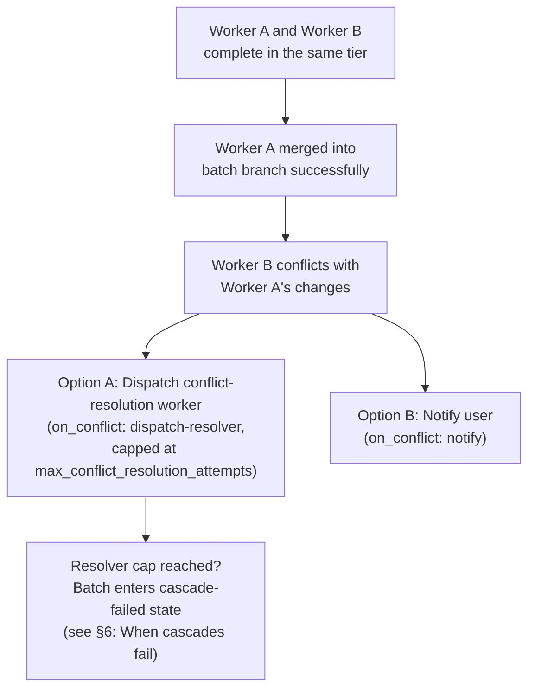

### Recovering from a Stuck Tier

When a tier is stuck (worker failed and auto-redispatch exhausted):

1. **Fix and re-dispatch.** Edit the issue to clarify/reduce scope, then
   `herd dispatch <issue-number>`.
2. **Cancel the batch.** `herd batch cancel <number>` stops everything.

In v1.0, you cannot skip a single failed issue or remove it from the batch. If
it blocks everything and can't be fixed, cancel and re-plan.

---

## 11. Dispatch Model

Four actors dispatch work:

1. **`herd plan` dispatches Tier 0** automatically after the user approves the
   plan. The batch branch is created and Tier 0 workers are triggered. No
   separate command needed.

2. **`herd integrator advance` dispatches subsequent tiers** automatically when
   a tier completes (triggered by `workflow_run` events after worker completion).
   It rebuilds the DAG, identifies the current tier, labels next-tier issues as
   `herd/status:ready`, and dispatches workers (respecting `max_concurrent`
   globally across all batches).

3. **The Monitor re-dispatches failed work** if `auto_redispatch` is enabled,
   with exponential backoff.

4. **The Monitor dispatches stale ready issues** that were left behind when
   `max_concurrent` prevented dispatch during tier advancement. After
   `stale_threshold_minutes`, the Monitor picks them up and dispatches them
   (respecting concurrency limits).

For manual control, `herd plan --no-dispatch` creates issues without dispatching.
The user can then dispatch with `herd dispatch --batch <N>`.

---

## 12. Commands

HerdOS supports `/herd` commands posted as comments on issues and PRs. This provides a unified entry point for both human and automated interactions.

### Architecture

The comment command system is in `internal/commands/`. It is designed as a set of composable functions called through a registry, with two entry points:

1. **Phase 1 (current):** The `issue_comment` webhook triggers the `handle-comment` job in the integrator workflow, which calls `herd integrator handle-comment`. This parses the command and dispatches to the registered handler.
2. **Phase 2 (future GitHub App):** An agent interprets natural language and calls the same handler functions as tool calls.

### Permission Model

Commands are accepted from users with `OWNER`, `MEMBER`, or `COLLABORATOR` association on the repository, plus bot users (login ending in `[bot]`). Other commenters are silently ignored.

### Acknowledgment Flow

1. User posts `/herd <command>` as a comment
2. Workflow reacts with 👀 on the comment
3. Handler executes the command
4. Result posted as a reply comment (success message or error)

### Monitor Integration

### Available Commands

| Command | Kind | Context | Description |
|---------|------|---------|-------------|
| `/herd fix-ci` | Slash | Issue or PR | Check CI status and dispatch a fix worker if CI failed |
| `/herd retry` | Slash | Issue | Re-dispatch the current failed issue's worker |
| `/herd retry <N>` | Slash | Issue or PR | Re-dispatch failed issue #N's worker |
| `/herd review` | Slash | PR | Trigger an agent review of the PR |
| `/herd fix <description>` | Slash | PR | Create a fix issue from the description and dispatch a worker |
| `/herd integrate` | Slash | Issue or PR | Run the full integrator cycle: consolidate → check CI → advance → review |
| `/herd dispatch` | Slash | Issue | Dispatch the current issue (must be ready or blocked) |
| `/herd dispatch <N>` | Slash | Issue or PR | Dispatch issue #N (must be ready or blocked) |
| `herd review <pr-number>` | CLI | Local terminal | Open an interactive Claude Code session pre-loaded with diff coverage, comments, CI status, and chunk 1/N of the PR diff. The agent acts as a reviewer assistant — you drive the conversation; it can read code and discuss findings, and it drafts `/herd fix` comments for any actionable changes (it never edits files locally). It does NOT auto-dispatch workers or create issues. |
| `herd dashboard` | CLI | Local terminal | Live read-only TUI showing active workers, open batches, and recent failures. Refreshes on a `--refresh-seconds` timer (default 15, clamp 5–300). Keybinds: `q` quit, `r` refresh, ↑/↓ select batch, Enter to open the batch's PR or milestone. Worker rows render as OSC 8 hyperlinks where supported. Single-repo and read-only in v1. |

Note on `herd review <pr-number>` vs `/herd review`: the CLI command opens an interactive local agent session for discussing a PR — the session is read-only on the working tree, and the only way it enacts changes is by drafting a `/herd fix` comment that you approve and post via `gh pr comment`; herd's batch workers then handle the actual edits. For large PRs, the initial interactive prompt includes the coverage summary plus only chunk 1/N so humans can see the limitation before making full-PR conclusions. The slash command runs an automated agent review on the PR and posts aggregated findings as a comment. Use the CLI when you want a back-and-forth; use the slash command when you want a one-shot pre-screen.

The review session is intentionally read-only on the working tree. Local edits during a review would create phantom commits that the integrator does not track and would conflict with any in-flight fix workers in the batch. All changes flow through `/herd fix` comments, which are dispatched to workers like any other batch task.

#### Draft-and-confirm /herd fix comments

When the interactive `herd review <pr-number>` session reaches a concrete actionable conclusion — for example, "this finding is wrong, but we should still fix X" or "yes, let's add a test for Y" — the agent proactively drafts a `/herd fix` comment scoped to a single, focused task with specific files/functions and acceptance criteria. The agent shows the draft to the user and asks for approval; it never auto-posts. On approval, the agent posts the comment using `gh pr comment <pr-number> --repo <owner>/<repo> --body "..."`. Once posted, the herd workers (via the existing [`/herd fix` comment-command pipeline](#available-commands)) take over. If the conversation is purely informational, the agent does not propose a `/herd fix` comment.

#### Non-Batch PR Reviews

`/herd review` works on any PR, not just batch PRs. When used on a non-batch PR, it runs the same chunked agent review and posts one aggregated severity-classified findings comment, but skips all batch-specific logic: no fix issues are created, no workers are dispatched, and no fix cycles are tracked. This is useful for getting an AI review on regular PRs without the full Herd orchestration.

#### Standalone /herd fix

`/herd fix` works on any PR, not just batch PRs. The [comment-command handler](#available-commands) selects a flow based on the PR's head branch:

- If the head branch starts with `herd/batch/`, the existing batch flow runs: a fix issue is created in the batch's milestone and consolidated through the integrator like any other fix worker.
- Otherwise, the standalone flow runs.

**Standalone flow.** The handler creates a tracking issue with no milestone, labeled `herd/type:standalone-fix` and `herd/status:in-progress`. The issue body frontmatter records `target_pr` and `target_branch`. A worker is dispatched with `mode=standalone`. That worker checks out the PR's head branch directly, runs the agent, runs [pre-push validation](#pre-push-validation), and pushes the result straight to the PR branch — there is no worker branch, no consolidation step, and no integrator pass.

**Result.** On success, the worker posts a confirmation comment on the PR (`✓ Standalone fix complete — pushed N commit(s) to <branch>`) and the tracking issue is closed and labeled `herd/status:done`. If the agent makes no changes, a no-op comment is posted on the PR and the tracking issue is closed.

**Out of scope.** Standalone fixes intentionally skip the automated recovery loops that batch fixes get:

- No automated review cycle — the user owns review of standalone fixes.
- No automated CI-fix loop.
- No conflict-resolution agent for push failures.

**Conflict on push.** If the target branch advanced on the remote between dispatch and push, the push is rejected. The tracking issue is labeled `herd/status:failed` and receives a comment asking the user to rebase the PR and re-run `/herd fix`.

**Concurrency.** At most one in-progress standalone fix is allowed per PR. A second `/herd fix` posted while one is still in progress is refused with a comment naming the in-progress tracking issue.

### Monitor Integration

The Monitor posts `/herd retry <N>` and `/herd fix-ci` comments instead of dispatching workflows directly. This ensures all command execution flows through the same handler, maintaining single responsibility.

### Failure Recovery

When integrator steps fail, the CLI posts a comment on the relevant issue or batch PR:

```
⚠️ **Integrator failed** during <step>: <error>

You can retry with `/herd integrate` on this issue or the batch PR.
```

The `/herd integrate` command manually triggers the full integrator cycle for a batch. It can be posted on:
- **Any issue belonging to a batch** — extracts the batch number from the issue's YAML frontmatter
- **A batch PR** — extracts the batch number from the `herd/batch/<N>-<slug>` branch name

The cycle runs: consolidate any remaining worker branches → check CI → advance tiers → review. This replaces the previous workaround of relabeling a done issue as failed to re-trigger the integrator.

Comments are posted to the issue being processed (for run-based triggers) or the batch PR (for batch-based triggers).

---

## Runaway Loop Protection

Every automated feedback loop has a hard cap:

| Loop | Config Key | Default | At Limit | Dedup Label |
|------|-----------|---------|----------|-------------|
| Agent review / fix / re-review | review_max_fix_cycles | 0 (unlimited) | Comments on PR, waits for human | — |
| Monitor re-dispatch | max_redispatch_attempts | 3 | Labels issue failed, stops | — |
| Conflict resolution | max_conflict_resolution_attempts | 2 | Batch enters [cascade-failed](#when-cascades-fail) state, blocks further resolvers | `herd/cascade-failed` |
| CI failure fix cycles | ci_max_fix_cycles | 0 (unlimited) | Notifies user | `herd/ci-fix-pending` |

### Merge Strategy

How the final batch PR lands on main:

| Strategy | Method | Result |
|----------|--------|--------|
| squash | Squash merge | Single commit on main, clean history (default) |
| rebase | Rebase merge | Individual worker commits preserved on main |
| merge | Merge commit | Merge commit, worker commits in branch |
