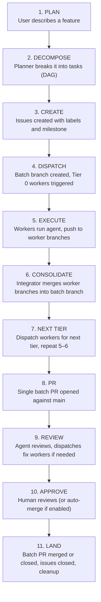
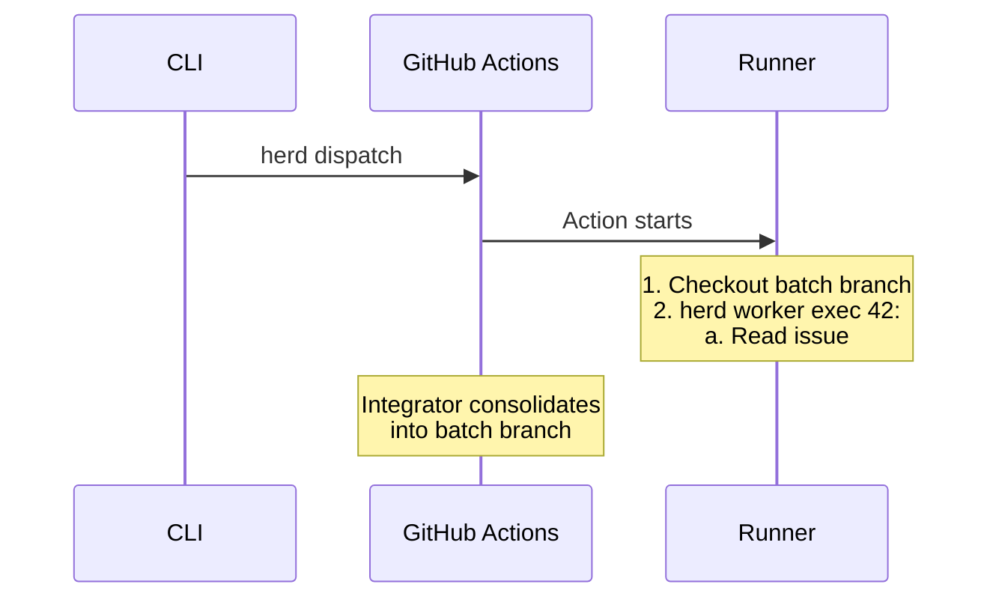
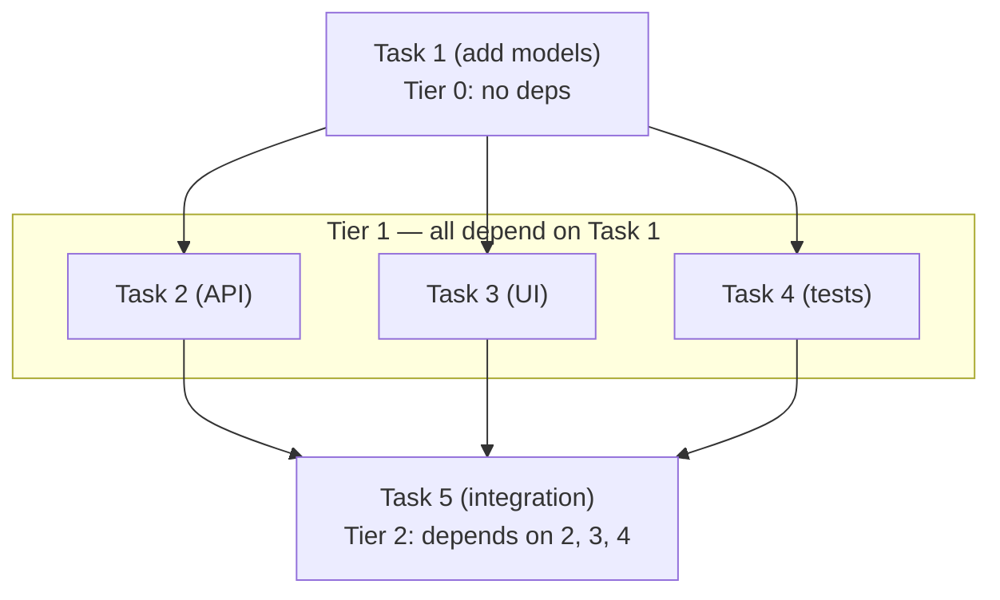
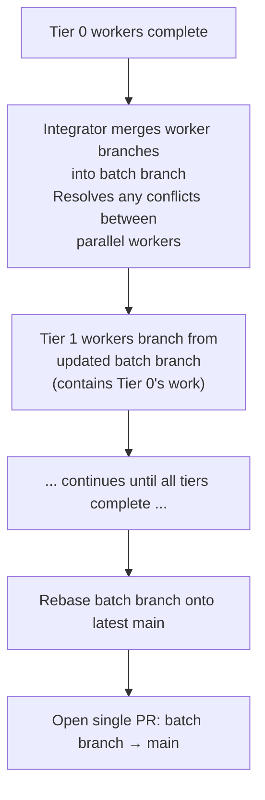
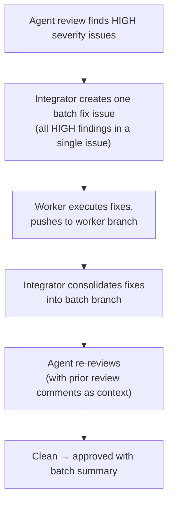
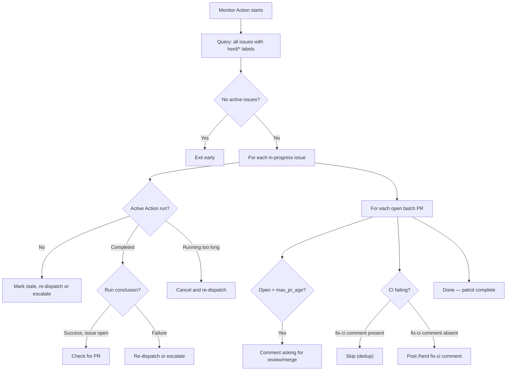
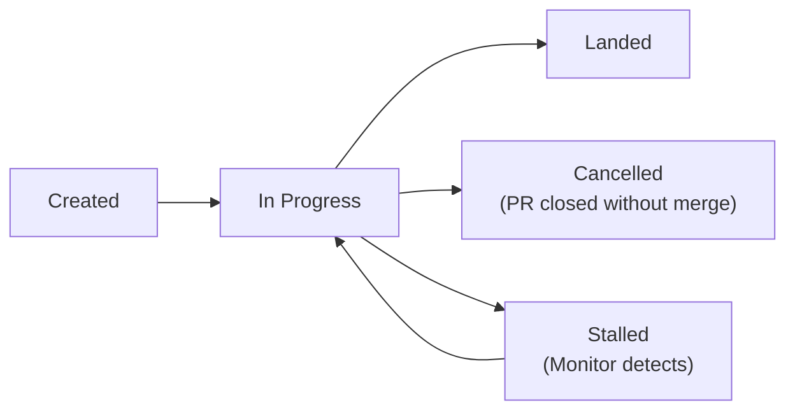
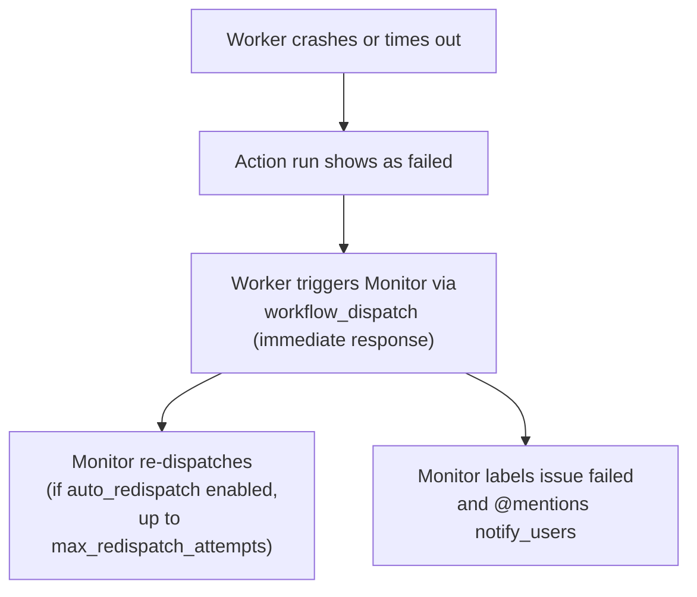
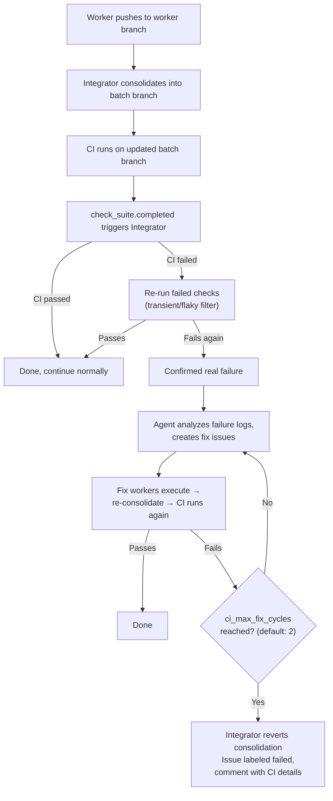
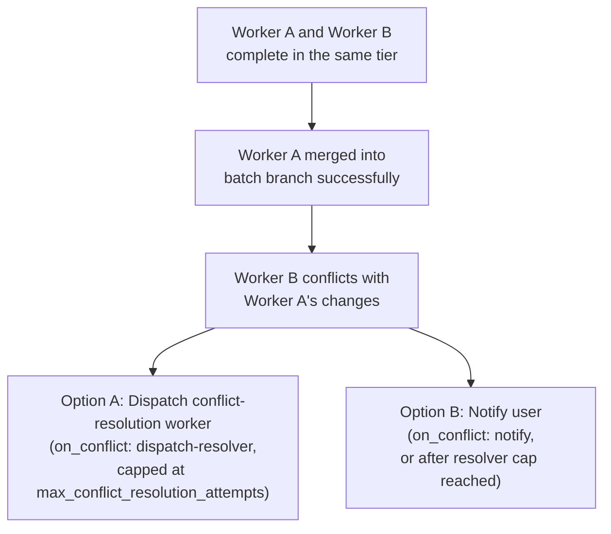

# Execution Design

How work flows from plan to landed code. This document covers the end-to-end
execution pipeline: worker lifecycle, DAG-based tier execution, consolidation,
agent review, conflict resolution, monitoring, and batch management.

---

## 1. End-to-End Flow

The happy path from user request to merged code:



The user runs `herd plan` and the system handles everything from there. The
Planner decomposes work into a DAG, creates issues with a milestone, and
dispatches Tier 0. The Integrator advances tiers automatically. Come back when
the batch PR is ready for review (or already merged, if auto-merge is enabled).

---

## 2. Workers

A worker is a single GitHub Actions workflow run. It receives an issue number,
checks out the batch branch, reads the issue body, runs the agent headlessly,
commits the result to a worker branch, and exits. Workers are stateless and
ephemeral -- GitHub Actions handles scheduling, logging, and cleanup.

### Lifecycle



### Headless Permissions

Workers run in fully automated CI with no human present. The agent must never
pause for permission prompts. This is safe because workers run on isolated
self-hosted runners (or ephemeral containers), operate on disposable worker
branches, and the Integrator reviews all changes before they reach main.

An optional `max_turns` setting limits agentic turns to prevent infinite loops
in headless mode. When set to zero (default), the agent uses its own limit.

### Commit Attribution

Worker commits attribute both the human and HerdOS:

- **Author**: the dispatching user (captured from `git config` at dispatch time)
- **Co-author**: HerdOS, via a `Co-authored-by` trailer

### Role Instructions

If `.herd/worker.md` exists in the repository, its contents are appended to the
worker's system prompt. Convention-based, no configuration needed.

### Pre-Push Validation

Before pushing changes, workers run validation commands:
1. `go build ./...`
2. `go test ./...`
3. `go vet ./...`
4. `golangci-lint run ./...` (if available)

If validation fails, the agent is re-invoked with the error output. If it fails again after retry, the worker is marked as failed.

Validation is Go-specific — it only runs when a `go.mod` file exists in the repository root.

### Worker Reports

After completing a task, workers post a structured report on the issue:
- Files changed (git diff stat)
- Summary of work done
- Validation results (build/test/vet/lint status)
- Full agent output in a collapsible details block

Workers also post a report on the no-op path (when no changes are needed). The
no-op report includes a "No changes were needed" message with the agent output
in a collapsible details block.

### Image Preprocessing

Before invoking the agent, the worker scans the issue body for GitHub-hosted
attachment images (URLs matching `github.com/user-attachments/assets/*`,
`github.com/<owner>/<repo>/assets/*`, and
`private-user-images.githubusercontent.com/*`). Matched images are downloaded to
`.herd/tmp/images/` and the markdown URLs are replaced with local file paths so
the agent can view them directly. External image URLs are left unchanged for the
agent to handle. Downloading is best-effort -- if the HTTP client is unavailable
or a download fails, the original URL is preserved.

### Incremental Push and Progress Tracking

Workers push incrementally during execution to preserve partial work. The
agent's system prompt instructs it to run `git push` after completing each
file or logical unit. This ensures that if the worker times out or crashes,
the retry starts from where it left off rather than from scratch.

To track progress, the agent creates a `WORKER_PROGRESS.md` file at the
repository root before its first push. This file contains a checklist of
completed and remaining items. On retry, the agent reads the existing file
to understand what was already done.

Example `WORKER_PROGRESS.md`:
```
- [x] Create auth model in internal/auth/model.go
- [x] Add validation helpers
- [ ] Write unit tests
- [ ] Update API handler
```

The Integrator removes `WORKER_PROGRESS.md` during consolidation (after
merging the worker branch into the batch branch) so it does not appear in
the final batch PR.

#### Retry Resume

When a worker is re-dispatched for a previously timed-out task, it checks
whether the worker branch already exists on the remote. If it does, the
worker checks out the existing branch (which contains partial work from the
previous attempt) instead of creating a fresh branch from the batch branch.
The agent then reads `WORKER_PROGRESS.md` to continue where the previous
attempt stopped.

### Concurrency

Multiple workers run simultaneously on separate branches. Concurrency is bounded
by runner availability, the `max_concurrent` config setting (default 3), and
GitHub Actions limits.

### Failure Modes

| Failure | Response |
|---------|----------|
| Worker crashes mid-task | Partial work preserved via incremental pushes; Action fails; worker triggers Monitor for immediate response; Monitor re-dispatches; retried worker resumes from existing branch and WORKER_PROGRESS.md |
| Worker produces bad code | Integrator re-runs failed CI once (transient filter), then dispatches fix workers up to the CI fix cap; at cap, reverts consolidation and labels issue failed |
| Worker can't complete task | Labels issue failed, triggers Monitor; Monitor comments diagnostics and @mentions notify_users |
| Work already done (no-op) | Posts a Worker Report comment ("No changes were needed"), labels issue done without creating a branch; Integrator advances normally |
| Runner offline | Action queues until a runner is available; no special handling |

---

## 3. DAG and Tiers

Tasks in a batch form a directed acyclic graph based on their `depends_on`
declarations. The DAG determines execution order:



Tasks within a tier run in parallel. Tiers execute sequentially.

### Tier Assignment (Kahn's Algorithm)

1. Build a dependency graph from each issue's `depends_on` field
2. Issues with no dependencies are Tier 0
3. Issues whose dependencies are all in Tier N or earlier are Tier N+1
4. If a cycle is detected (no zero-in-degree issues remain but unassigned issues
   exist), the CLI reports the circular dependencies and refuses to dispatch

Cross-batch dependencies are not supported. All `depends_on` references must
point to issues within the same milestone; the CLI validates this during
planning and dispatch.

### Tier Completion

A tier is **complete** when all its issues are `herd/status:done`. If any issue
is `herd/status:failed`, the tier is **stuck** -- the Integrator does not
advance. The Monitor detects stuck tiers and can re-dispatch failed issues or
escalate.

### No Mid-Batch Rebase

The batch branch is not rebased onto main between tiers -- only when all tiers
are complete and the batch PR is about to open. Later-tier workers see prior
tiers' work but not changes that landed on main after the batch started. This
is intentional: mid-batch rebasing would invalidate prior tiers' work and
introduce unpredictable conflicts.

---

## 4. Consolidation

### Batch Branch Lifecycle

Every batch gets a long-lived branch: `herd/batch/<milestone-id>-<slug>`. It is
created from main when workers are first dispatched (by `herd plan` or
`herd dispatch`). Workers branch from it; the Integrator merges their work back
into it. When all tiers complete, this branch becomes the source of the single
batch PR against main.

### Consolidation Flow



Opening the batch PR is idempotent: if concurrent advance-on-close triggers race, the second call detects the existing PR (via listing or by handling a 422 "already exists" error) and returns its number instead of failing.

### Run-to-Branch Resolution

Given a completed workflow run ID, the Integrator resolves the worker branch:

1. Query the run's workflow_dispatch inputs to extract the issue number
2. Derive the worker branch name from convention: `herd/worker/<number>-<slug>`
3. Check the run conclusion: success means look for a worker branch; failure
   means update issue labels and skip merge
4. If the worker branch exists, merge into batch branch. If no branch exists
   (no-op worker), skip merge. Either way, the issue counts toward tier
   completion.

### Branch Cleanup

**Worker branches** are deleted after successful consolidation. Failed worker
branches are kept for debugging until re-dispatch or batch cancellation.

**Batch branches** are deleted on cancel (`herd batch cancel`), on merge
(GitHub auto-delete or Integrator cleanup), or when the batch PR is closed
without merging (Integrator cleanup).

---

## 5. Agent Review and Fix Cycles

When all tiers complete and the batch PR opens, the Integrator dispatches an
agent to review the consolidated diff. The agent checks acceptance criteria,
looks for bugs, security issues, and style violations. Before reviewing, the
reviewer collects any `/herd fix` comments from the batch PR and appends them
to the acceptance criteria list as `"User requested: <description>"`. This
ensures the reviewer checks user-requested changes equally alongside original
acceptance criteria, rather than treating them as a separate prompt section.

### Severity-Based Filtering

Review findings are classified by severity:

| Severity | Examples | Action |
|----------|----------|--------|
| HIGH | Bugs, security vulnerabilities, race conditions, missing critical error handling | Creates fix issues, dispatches workers |
| MEDIUM | Missing edge cases, suboptimal error handling | Creates fix issues, dispatches workers |
| LOW | Style preferences, naming suggestions | Listed in PR comment, no fix workers |

The `review_strictness` setting (standard/strict/lenient) controls which issues the agent flags. See [Configuration](../configuration.md#review-strictness) for details.

### Review Outcomes

| Result | Action |
|--------|--------|
| Approved | Agent posts a batch summary with statistics (files reviewed, findings by severity, fix cycles used). PR is ready for human review (or auto-merge). |
| Changes requested | Agent submits a Request Changes review to block merge. Integrator creates a single batch fix issue for all HIGH findings. |

### Fix Cycle Flow



Fix issues are labeled `herd/type:fix`, have no dependencies (run in parallel),
and track which review cycle spawned them via a `fix_cycle` field and a
`batch_pr` reference back to the PR. Findings are deduplicated against open fix
issues to avoid creating duplicate work.

When `/herd fix` creates a fix issue, all comments from the batch PR are
included as a `## Conversation History` section in the issue body. Each comment
is formatted as `**@author:**` followed by the comment body, separated by `---`.
This gives the fix worker full context of prior fix requests and review feedback.

On each re-review, the reviewer receives its prior review comments as context to
maintain consistency and avoid contradicting previous decisions. This cycle
repeats until the agent approves or `review_max_fix_cycles` (default 3) is
reached, at which point the Integrator comments on the PR with the remaining
issues and waits for human intervention.

### Safety Valve

If a single review cycle finds more than **10 issues**, the Integrator does not
create fix workers. Instead, it comments on the PR with all issues found and
escalates to the user. This prevents a confused or overzealous agent from
generating dozens of fix workers in one pass.

### Interaction with Auto-Merge

| review | auto_merge | Behavior |
|--------|------------|----------|
| true | false | Agent reviews first, then human. Human gets a pre-screened PR. (Default) |
| true | true | Agent is gatekeeper. Approves + CI pass = auto-merge. Issues block merge and trigger fix workers. |
| false | true | No agent review. PR auto-merges as soon as CI passes. |
| false | false | No agent review. Human reviews the batch PR directly. |

---

## 6. Conflict Resolution

Conflicts can occur in two places.

### Between Parallel Workers (Same Tier)

When workers in the same tier modify overlapping files, the Integrator
reconciles during consolidation:

1. **Auto-rebase.** If changes don't textually conflict, rebase succeeds.
2. **Dispatch a conflict-resolution worker.** The Integrator creates a fix issue
   describing the conflict, the conflicting files, and the intent of each
   worker. The resolver checks out the batch branch, reads both worker branches,
   and produces a merged result. It pushes to its own worker branch and the
   normal consolidate/advance flow handles it.
3. **Notify the user.** Comment on the relevant issues with conflict details.
   The user resolves manually.

### Between Batch Branch and Main

Main may advance while the batch executes. Before opening the PR, the Integrator
rebases the batch branch onto latest main. If this conflicts, the same
resolution strategies apply. The resolver force-pushes to the batch branch (the
one acceptable force-push -- HerdOS owns the branch).

The configured strategy (`on_conflict: notify | dispatch-resolver`) controls
which path is taken. The resolver is capped at `max_conflict_resolution_attempts`
(default 2); after that, it falls back to notify regardless of config.

---

## 7. Monitor

The Monitor is a scheduled GitHub Action that audits system state and takes
corrective action. It is completely stateless -- each patrol cycle recomputes
everything from the GitHub API.

### Patrol Responsibilities

Each cycle:



### Exponential Backoff

For repeatedly failing issues, the Monitor spaces out re-dispatch attempts:

- 1st failure: re-dispatch immediately
- 2nd failure: wait 15 minutes
- 3rd failure: wait 1 hour
- After `max_redispatch_attempts` (default 3): label `herd/status:failed`, stop

Backoff is enforced statelessly by comparing the most recent failed run's
timestamp against the required delay. The natural patrol interval (default
15 minutes) handles spacing; for the 1-hour wait, the Monitor skips ~3 cycles.

### Stateless Enforcement

The Monitor stores no state. Failure counts come from querying all completed
worker workflow runs filtered by issue number and counting those with
`conclusion: "failure"`. Backoff delays are enforced by timestamp comparison.
This means the Monitor can be restarted, re-deployed, or run on different
runners without losing track of anything.

### Escalation

When auto-resolution fails, the Monitor comments on the issue with diagnostics
(Action run URL, error logs, time elapsed), @mentions the configured
`notify_users`, and labels the issue `herd/status:failed`. It uses GitHub's
native notification system exclusively -- no Slack, email, or external
integrations.

---

## 8. Batches

A batch is a group of related issues forming a delivery unit, mapped to a GitHub
Milestone.

### Why Milestones Over Projects

| Feature | Milestones | Projects |
|---------|-----------|----------|
| Setup complexity | Zero (built-in) | Requires project board creation |
| API simplicity | Simple REST endpoints | GraphQL-heavy |
| Progress tracking | Built-in percentage | Requires custom views |
| Issue association | Direct field on issue | Requires adding to project |
| Suitable for | Task batches with clear completion | Ongoing work streams |

Milestones fit because batches have a clear end state: all issues closed.

### Lifecycle



- **Created**: Milestone exists, issues created, nothing dispatched
- **In Progress**: At least one worker active or one issue done
- **Stalled**: Issues stuck (failed workers, unresolved conflicts); Monitor
  escalates
- **Landed**: All issues done, batch PR merged, milestone closed
- **Cancelled**: Batch PR closed without merging. Non-done issues are labelled
  `herd/status:cancelled` and closed. Done issues are closed without relabelling.
  Milestone is closed, branch is deleted.

### Cancellation

There are two ways a batch can be cancelled:

**CLI cancellation** (`herd batch cancel <number>`):

1. Cancels any active workflow runs for the batch's issues
2. Labels remaining open issues as `herd/status:failed`
3. Closes the milestone
4. Deletes the batch branch

Active workers may take a moment to stop -- Actions cancellation is asynchronous.

**Closing the batch PR without merging:**

1. Non-done issues are labelled `herd/status:cancelled` and closed. Issues
   already `herd/status:done` are closed without relabelling.
2. Milestone is closed
3. Branch is deleted

The key difference: `herd batch cancel` labels issues as `failed` (indicating
work was attempted but did not succeed), while closing the PR labels non-done
issues as `cancelled` (indicating the batch was abandoned).

---

## 9. Manual Tasks

Some tasks require human action (infrastructure setup, external service config,
approval gates). These are labeled `herd/type:manual` by the Planner and marked
with 👤 in status output.

Manual tasks participate fully in the DAG:

- **Not dispatched** -- `herd dispatch` skips them, and the internal `dispatchIssue` helper (used by `herd plan` and the Integrator) also skips them
- **Unblocked on tier advancement** -- when the previous tier completes, manual tasks transition from `blocked` to `ready` like any other task, but are not dispatched to workers
- **Completed by closing** -- a human closes the issue (or labels it
  `herd/status:done`); the Integrator's `advance-on-close` job detects the
  close event, advances the tier, and runs agent review if all tiers are done
- **Tier-aware** -- if a manual task is in Tier 0, Tier 1 won't dispatch until
  it's closed. Manual tasks that grant permissions or set up external services should always be in Tier 0 so they unblock automated tasks that depend on them
- **Notifications** -- when `notify_users` is configured, the Planner @mentions
  those users on manual task issues for visibility

---

## 10. Agent Error Resilience

The claude agent package validates output from every agent invocation. When Claude Code exits with code 0 but returns suspicious output (empty, "Execution error", or very short single-line output under 20 characters), the system:

1. **Retries once** after a 5-second delay
2. If the retry also returns suspicious output, **returns an error** instead of treating it as a successful result
3. The worker posts a **"Worker failed"** comment on the issue explaining what happened
4. The deferred error handler labels the issue as `failed` and triggers the Monitor

This prevents the system from marking issues as done when the agent didn't actually do any work (e.g., during API instability). The integrator also handles review agent failures gracefully -- if the review agent fails, the review cycle is skipped entirely (no approval, no fix issues) and will retry on the next trigger.

---

## 11. Failure Modes

### Worker Fails to Complete



The batch branch is unaffected -- the failed worker's branch is never merged.

### Worker Produces Code That Doesn't Build



### Merge Conflict Between Parallel Workers



### Recovering from a Stuck Tier

When a tier is stuck (worker failed and auto-redispatch exhausted):

1. **Fix and re-dispatch.** Edit the issue to clarify/reduce scope, then
   `herd dispatch <issue-number>`.
2. **Cancel the batch.** `herd batch cancel <number>` stops everything.

In v1.0, you cannot skip a single failed issue or remove it from the batch. If
it blocks everything and can't be fixed, cancel and re-plan.

---

## 11. Dispatch Model

Three actors dispatch work:

1. **`herd plan` dispatches Tier 0** automatically after the user approves the
   plan. The batch branch is created and Tier 0 workers are triggered. No
   separate command needed.

2. **`herd integrator advance` dispatches subsequent tiers** automatically when
   a tier completes (triggered by `workflow_run` events after worker completion).
   It rebuilds the DAG, identifies the current tier, labels next-tier issues as
   `herd/status:ready`, and dispatches workers (respecting `max_concurrent`
   globally across all batches).

3. **The Monitor re-dispatches failed work** if `auto_redispatch` is enabled,
   with exponential backoff.

For manual control, `herd plan --no-dispatch` creates issues without dispatching.
The user can then dispatch with `herd dispatch --batch <N>`.

---

## 12. Comment Commands

HerdOS supports `/herd` commands posted as comments on issues and PRs. This provides a unified entry point for both human and automated interactions.

### Architecture

The comment command system is in `internal/commands/`. It is designed as a set of composable functions called through a registry, with two entry points:

1. **Phase 1 (current):** The `issue_comment` webhook triggers the `handle-comment` job in the integrator workflow, which calls `herd integrator handle-comment`. This parses the command and dispatches to the registered handler.
2. **Phase 2 (future GitHub App):** An agent interprets natural language and calls the same handler functions as tool calls.

### Permission Model

Commands are accepted from users with `OWNER`, `MEMBER`, or `COLLABORATOR` association on the repository, plus bot users (login ending in `[bot]`). Other commenters are silently ignored.

### Acknowledgment Flow

1. User posts `/herd <command>` as a comment
2. Workflow reacts with 👀 on the comment
3. Handler executes the command
4. Result posted as a reply comment (success message or error)

### Monitor Integration

The Monitor posts `/herd retry <N>` and `/herd fix-ci` comments instead of dispatching workflows directly. This ensures all command execution flows through the same handler, maintaining single responsibility.

---

## Runaway Loop Protection

Every automated feedback loop has a hard cap:

| Loop | Config Key | Default | At Limit |
|------|-----------|---------|----------|
| Agent review / fix / re-review | review_max_fix_cycles | 3 | Comments on PR, waits for human |
| Monitor re-dispatch | max_redispatch_attempts | 3 | Labels issue failed, stops |
| Conflict resolution | max_conflict_resolution_attempts | 2 | Falls back to notify |
| CI failure fix cycles | ci_max_fix_cycles | 2 | Reverts consolidation, notifies user (0 = notify-only) |

### Merge Strategy

How the final batch PR lands on main:

| Strategy | Method | Result |
|----------|--------|--------|
| squash | Squash merge | Single commit on main, clean history (default) |
| rebase | Rebase merge | Individual worker commits preserved on main |
| merge | Merge commit | Merge commit, worker commits in branch |
